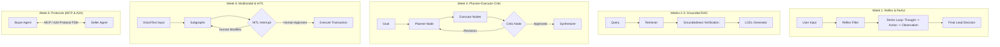

```mermaid
flowchart TB
    subgraph W1["Week 1: Reflex & ReAct"]
        U1["User Input"] --> R1["Reflex Filter"]
        R1 --> L1["ReAct Loop: Thought -> Action -> Observation"]
        L1 --> O1["Final Lead Decision"]
    end

    subgraph W2["Weeks 2-3: Grounded RAG"]
        U2["Query"] --> RT2["Retriever"]
        RT2 --> GR2["Groundedness Verification"]
        GR2 --> AG2["LCEL Generator"]
    end

    subgraph W4["Week 4: Planner-Executor-Critic"]
        U4["Goal"] --> PL4["Planner Node"]
        PL4 --> EX4["Executor Nodes"]
        EX4 --> CR4{"Critic Node"}
        CR4 -- "Revisions" --> PL4
        CR4 -- "Approved" --> SY4["Synthesizer"]
    end

    subgraph W5["Week 5: Multimodal & HITL"]
        U5["Voice/Text Input"] --> SG5["Subgraphs"]
        SG5 --> INT5{"HITL Interrupt"}
        INT5 -- "Human Approves" --> EX5["Execute Transaction"]
        INT5 -- "Human Modifies" --> SG5
    end

    subgraph W6["Week 6: Protocols (MCP & A2A)"]
        A_BUY["Buyer Agent"] <-->|"MCP / A2A Protocol FSM"| A_SELL["Seller Agent"]
    end
```