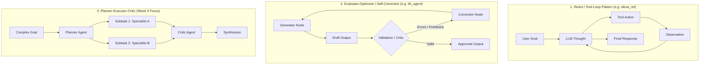

# 🚀 Agentic AI & Enterprise Multi-Agent Systems

[](https://www.python.org/downloads/)
[](https://python.langchain.com/)
[](https://langchain-ai.github.io/langgraph/)
[](https://modelcontextprotocol.io/)
[](https://github.com/astral-sh/ruff)

A comprehensive, production-oriented repository implementing end-to-end demonstrations, live projects, architecture patterns, and benchmarks across the entire lifecycle of **Agentic AI and Multi-Agent Systems**.

---

## 📑 Table of Contents

- [Architectural Philosophy](#-architectural-philosophy)
- [Course Syllabus & Roadmap](#-course-syllabus--roadmap)
- [Repository Structure](#-repository-structure)
- [Core Design Patterns Matrix](#-core-design-patterns-matrix)
- [Environment Setup & Installation](#-environment-setup--installation)
- [Live Projects Overview](#-live-projects-overview)
- [Engineering & Code Standards](#-engineering--code-standards)
- [Contributing & Development Workflow](#-contributing--development-workflow)

---

## 🏛 Architectural Philosophy

This repository adheres to production-grade engineering principles for LLM applications:

1. **Explicit State Over Free-Form Prompts:** Multi-step decision making uses deterministic state graphs (LangGraph) rather than open-ended LLM loops.
2. **Standardized Communication Protocols:** Agents and tools communicate via typed contracts, Finite State Machines (FSM), and open protocols like **Model Context Protocol (MCP)** and **Agent-to-Agent (A2A)**.
3. **Defense-in-Depth Safety & PII Sanitization:** Input validation, output guardrails, and deterministic PII redaction (Microsoft Presidio) before model ingestion.
4. **Evaluation-First Development (Eval-Driven Dev):** Every agent pipeline includes automated test suites, LLM-as-judge benchmarks, groundedness metrics, and LangSmith tracing.
5. **Cost & Latency Optimization:** Tiered model routing, semantic caching, and strict token budgeting.

---

## 🗺 Course Syllabus & Roadmap

| Module | Topic | Core Focus & Techniques | Live Project Deliverable |
| :--- | :--- | :--- | :--- |
| **Week 1** | **Agentic AI Foundations & Reflex Agents** | • The Agent Equation: `Agent = LLM + Tools + Memory + Planning`<br>• The ReAct loop (`Reasoning` + `Acting`)<br>• Five core agentic design patterns<br>• Agentic vs. Autonomous decision-making & prompt engineering | [CRM Lead Qualifier Agent](week-01-foundations-reflex-agents/) |
| **Weeks 2–3** | **RAG-Powered Knowledge Agents** | • Retrieve → Augment → Generate with LangChain LCEL<br>• Multi-turn RAG with conversation memory & query reformulation<br>• Hallucination prevention & citation verification<br>• Retrieval & Generation Metrics (Precision@K, MRR, Groundedness) | [Grounded IT Support Knowledge Assistant](weeks-02-03-rag-knowledge-agents/) |
| **Week 4** | **Multi-Agent Systems (Planner–Executor–Critic)** | • Role-based agent orchestration & task decomposition<br>• LangGraph state schemas, nodes, conditional edges<br>• Checkpointer persistence & thread isolation<br>• Feedback loops with Critic/Synthesizer agents | [Multi-Agent Travel Planner](week-04-multi-agent-systems/) |
| **Week 5** | **Conversational & Multimodal Agents** | • Cascaded (STT→LLM→TTS) vs. Realtime Speech architectures<br>• LangGraph subgraphs for modular conversation management<br>• Human-in-the-Loop (HITL): Approve, Review-and-Edit, Interrupt patterns | [Voice-Enabled E-Commerce Assistant with HITL](week-05-conversational-multimodal-hitl/) |
| **Week 6** | **Agent Communication Protocols (MCP, A2A, ACP)** | • Structured tool exposure via Anthropic's **Model Context Protocol (MCP)** & FastMCP<br>• Reliable FSM-driven message transition contracts<br>• Networked multi-agent coordination with Google ADK / A2A | [Real Estate Negotiation Simulator](week-06-agent-communication-protocols/) |
| **Week 7** | **Hybrid Search & Retrieval** | • Sparse vs. Dense representations (BM25, BGE, HNSW, k-NN/ANN)<br>• Learned lexical sparse matching with SPLADE<br>• Reciprocal Rank Fusion (RRF) & cross-encoder re-ranking in Qdrant | [Hybrid Product Search Agent (SPLADE + BGE + RRF)](week-07-hybrid-search-retrieval/) |
| **Week 8** | **Agent Observability, Evaluation & Safety** | • LangSmith distributed tracing & dataset curation<br>• LLM-as-judge, DeepEval (Hallucination, G-Eval, Faithfulness)<br>• Guardrails AI & Presidio PII anonymization<br>• Cost control via semantic caching, batching & prompt routing | [Production-Ready Fintech Support Agent](week-08-observability-evals-safety/) |
| **Week 9** | **Fine-Tuning & Domain Adaptation** | • Escalation framework: *Prompting vs. RAG vs. Fine-Tuning*<br>• PEFT landscape: LoRA, QLoRA, Prefix Tuning, Adapters<br>• 4-bit quantization, Hugging Face TRL `SFTTrainer`<br>• Packaging and deploying adapters to Hugging Face Hub | [Fine-Tuned Healthcare Q&A Agent](week-09-fine-tuning-domain-adaptation/) |
| **Weeks 10–11**| **Capstone: Enterprise Multi-Agent System** | • Production end-to-end multi-agent enterprise platform<br>• Hybrid retrieval + LangGraph multi-agent orchestration<br>• Full observability, HITL compliance, evals & cost dashboards<br>• Interactive UI (Streamlit) & production deployment patterns | [Enterprise Multi-Agent Platform](weeks-10-11-capstone-enterprise-system/) |

---

## 📂 Repository Structure

```text
.
├── README.md                                 # Master course overview, syllabus, & architecture guide
├── pyproject.toml                            # Project metadata & tooling config
├── requirements.txt                          # Pinned dependency manifest
├── .env.example                              # Environment variable template
├── .gitignore                                # Git ignore rules
│
├── common/                                   # Shared core utilities across modules
│   ├── config.py                             # Unified configuration & settings
│   ├── llm_factory.py                        # Model provider abstraction (OpenAI/Anthropic/Gemini)
│   ├── logging.py                            # Structured Rich console logger
│   └── schemas.py                            # Common Pydantic base models
│
├── week-01-foundations-reflex-agents/        # Week 1: Foundations, ReAct, Reflex Agents
│   ├── README.md
│   └── crm_lead_qualifier/
│       ├── __init__.py
│       ├── agent.py                          # Reflex & ReAct agent implementation
│       ├── tools.py                          # CRM scoring & enrich tools
│       ├── prompts.py                        # Structured system prompts
│       └── main.py                           # CLI demonstration
│
├── weeks-02-03-rag-knowledge-agents/         # Weeks 2-3: RAG, LCEL, Hallucination Prevention
│   ├── README.md
│   └── it_support_assistant/
│       ├── pipeline.py                       # LangChain LCEL RAG pipeline
│       ├── retriever.py                      # Multi-stage retriever & indexer
│       ├── evaluation.py                     # Precision@K & Groundedness metrics
│       └── app.py
│
├── week-04-multi-agent-systems/              # Week 4: Multi-Agent (Planner-Executor-Critic)
│   ├── README.md
│   └── travel_planner/
│       ├── state.py                          # Typed LangGraph state
│       ├── agents/                           # Planner, Executor, Critic, Synthesizer
│       ├── graph.py                          # LangGraph workflow definition
│       └── app.py
│
├── week-05-conversational-multimodal-hitl/   # Week 5: Multimodal & HITL Patterns
│   ├── README.md
│   └── ecommerce_hitl_assistant/
│       ├── subgraphs/                        # Reusable LangGraph subgraphs
│       ├── hitl_manager.py                   # Interrupt, approve & edit handlers
│       └── voice_pipeline.py                 # Cascaded STT/TTS pipeline
│
├── week-06-agent-communication-protocols/   # Week 6: MCP, A2A, and Protocol FSMs
│   ├── README.md
│   └── real_estate_negotiation/
│       ├── mcp_servers/                      # FastMCP server implementations
│       ├── protocol_fsm.py                   # State machine transition validator
│       ├── buyer_agent.py
│       └── seller_agent.py
│
├── week-07-hybrid-search-retrieval/          # Week 7: SPLADE, BGE, & Reciprocal Rank Fusion
│   ├── README.md
│   └── hybrid_product_search/
│       ├── dense_indexer.py                  # Dense embeddings (BGE)
│       ├── sparse_indexer.py                 # Sparse representations (SPLADE / BM25)
│       ├── rrf_fusion.py                     # Reciprocal Rank Fusion engine
│       └── agent.py
│
├── week-08-observability-evals-safety/       # Week 8: LangSmith, DeepEval, Presidio Guardrails
│   ├── README.md
│   └── fintech_support_agent/
│       ├── guardrails/                       # Presidio PII & safety checks
│       ├── evals/                            # DeepEval test suites & LLM-as-judge
│       ├── tracer.py                         # LangSmith tracing & telemetry
│       └── agent.py
│
├── week-09-fine-tuning-domain-adaptation/    # Week 9: PEFT, LoRA, QLoRA, TRL
│   ├── README.md
│   └── healthcare_qa_agent/
│       ├── dataset_prep.py                   # MedQuAD / Q&A dataset processor
│       ├── train_lora.py                     # TRL SFTTrainer + 4-bit QLoRA
│       ├── export_hf.py                      # Adapter exporter & merged pipeline
│       └── agent.py
│
└── weeks-10-11-capstone-enterprise-system/   # Weeks 10-11: Enterprise Multi-Agent Capstone
    ├── README.md
    └── enterprise_agent_system/
        ├── backend/                          # LangGraph enterprise multi-agent backend
        ├── frontend/                         # Streamlit real-time interactive UI
        ├── evals/                            # End-to-end regression & benchmark suite
        └── docker-compose.yml                # Containerized deployment stack
```

---

## 🧩 Core Design Patterns Matrix

```mermaid
flowchart TB
    subgraph W1["Week 1: Reflex & ReAct"]
        U1["User Input"] --> R1["Reflex Filter"]
        R1 --> L1["ReAct Loop: Thought -> Action -> Observation"]
        L1 --> O1["Final Lead Decision"]
    end

    subgraph W2["Weeks 2-3: Grounded RAG"]
        U2["Query"] --> RT2["Retriever"]
        RT2 --> GR2["Groundedness Verification"]
        GR2 --> AG2["LCEL Generator"]
    end

    subgraph W4["Week 4: Planner-Executor-Critic"]
        U4["Goal"] --> PL4["Planner Node"]
        PL4 --> EX4["Executor Nodes"]
        EX4 --> CR4{"Critic Node"}
        CR4 -- "Revisions" --> PL4
        CR4 -- "Approved" --> SY4["Synthesizer"]
    end

    subgraph W5["Week 5: Multimodal & HITL"]
        U5["Voice/Text Input"] --> SG5["Subgraphs"]
        SG5 --> INT5{"HITL Interrupt"}
        INT5 -- "Human Approves" --> EX5["Execute Transaction"]
        INT5 -- "Human Modifies" --> SG5
    end

    subgraph W6["Week 6: Protocols (MCP & A2A)"]
        A_BUY["Buyer Agent"] <-->|"MCP / A2A Protocol FSM"| A_SELL["Seller Agent"]
    end
```



---



## ⚡ Environment Setup & Installation

### 1. Prerequisites
- **Python:** 3.11 or higher
- **Virtual Environment Tool:** `venv` or `conda`

### 2. Clone and Setup Environment
```bash
# Clone repository
cd /Users/viswa/projects/FDE_kickstart_interview

# Create virtual environment
python3 -m venv .venv

# Activate virtual environment
source .venv/bin/activate

# Install dependencies
pip install --upgrade pip
pip install -r requirements.txt
```

### 3. Configure Environment Variables
```bash
cp .env.example .env
# Edit .env with your LLM API keys (OpenAI, Anthropic, Google Gemini, LangSmith, etc.)
```

---

## 🧪 Testing & Verification

Run tests across all modules or for a specific chapter:

```bash
# Run all unit and integration tests
pytest -v

# Run tests for a specific module (e.g., Week 1)
pytest week-01-foundations-reflex-agents/ -v
```

---

## 📐 Engineering & Code Standards

- **Type Safety:** All agent state, tool inputs, and structured outputs must use `pydantic.BaseModel` with type annotations.
- **Fail-Fast Protocols:** Tool outputs and agent communications must validate schema compliance and reject unformatted responses.
- **Auditing & Traceability:** All LLM invocations should route through LangSmith or structured loggers with session metadata.
- **Clean Architecture:** Keep domain business logic separate from LLM prompt templates and model wrappers.
