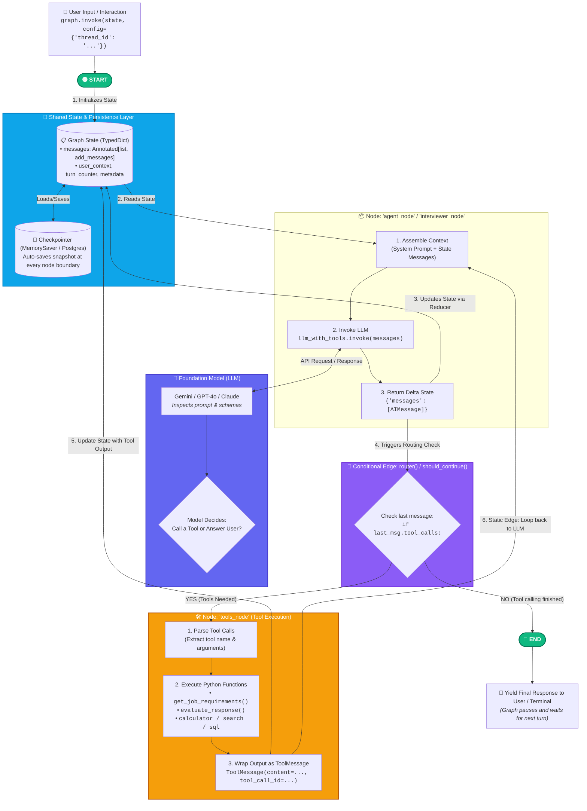

# 🏗️ LangGraph Complete Agent Architecture & Coordination Diagram

This diagram illustrates how **START/END**, **StateGraph Nodes**, **LLMs**, **Tools**, **Conditional Edges**, and the **Checkpointer (Memory)** coordinate at every step of execution.

