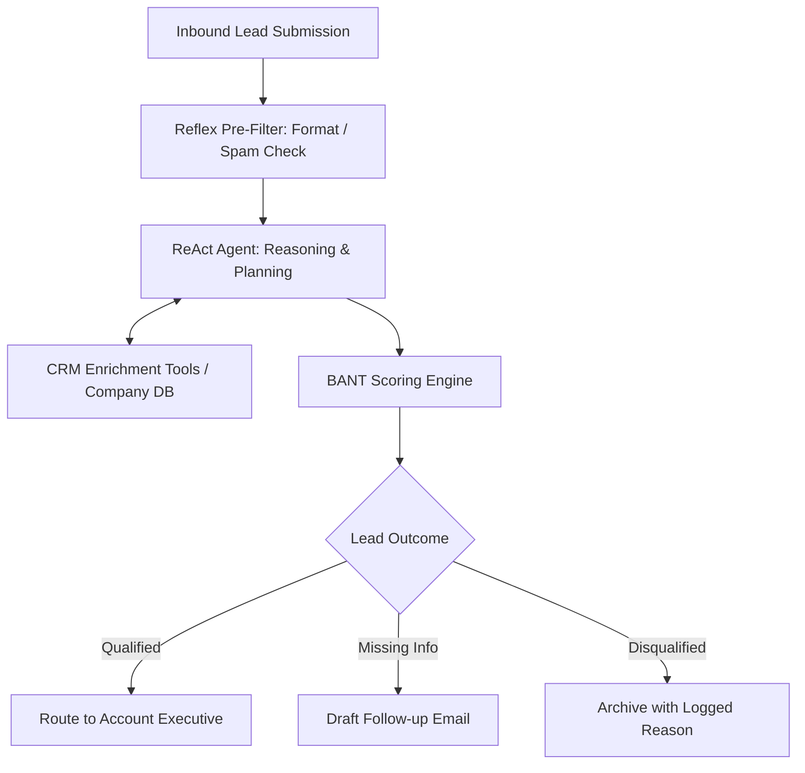

# Week 1: Agentic AI Foundations & Reflex Agents

## 📌 Objectives & Scope
- **The Agent Equation:** Understand how `Agent = LLM + Tools + Memory + Planning` differentiates reactive prompts from true agentic systems.
- **The ReAct Loop:** Master the interplay between `Thought` (Reasoning), `Action` (Tool Execution), and `Observation` (Environment Feedback).
- **Five Core Agentic Patterns:** Reflex, Tool-Use, Planning/ReAct, Memory-Augmented, and Self-Reflection.
- **Decision Matrix:** Determine when a task demands a deterministic workflow, an LLM chain, or an autonomous agent.

---

## 🏗 Live Project: CRM Lead Qualifier Agent

### Scenario
An enterprise inbound CRM pipeline receives uncurated sales leads. The agent must:
1. Parse incoming raw contact submissions (name, email, company, employee count, stated budget, use case).
2. Validate domain information and query enrichment tools (e.g., Company Lookup, Tech Stack Detector).
3. Score the lead according to BANT criteria (Budget, Authority, Need, Timeline).
4. Decide on an action: Auto-Qualify & Route to AE, Request More Info, or Mark Unqualified with rationale.

### Architecture Diagram


---

## 📂 Project Structure

```text
week-01-foundations-reflex-agents/
├── README.md
└── crm_lead_qualifier/
    ├── __init__.py
    ├── agent.py            # ReAct & Reflex agent logic
    ├── tools.py            # Domain lookup & enrichment mock tools
    ├── prompts.py          # Structured BANT system prompts
    ├── schemas.py          # Pydantic models for Lead data & BANT score
    └── main.py             # CLI runner with demo scenarios
```

---

## 🚀 Quickstart

```bash
# Run the CRM Lead Qualifier demonstration
python3 week-01-foundations-reflex-agents/crm_lead_qualifier/main.py
```
