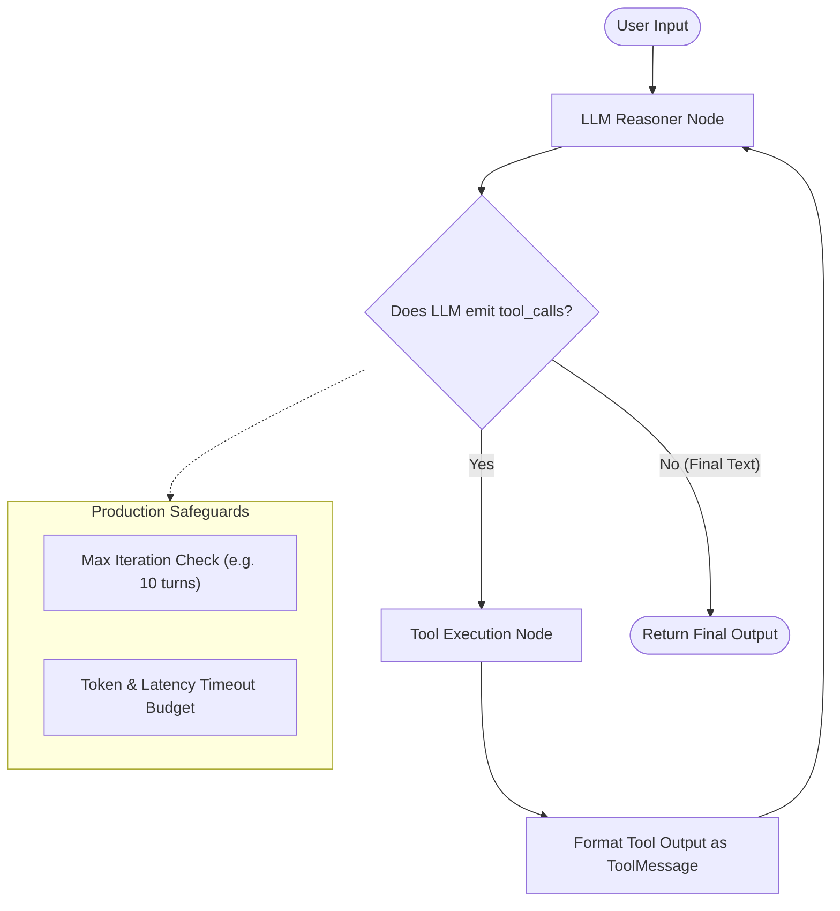

# 🔄 Design Pattern 01: ReAct (Reason + Act) / Tool-Calling Loop

> **Paper Origin:** *ReAct: Synergizing Reasoning and Acting in Language Models* (Yao et al., ICLR 2023)  
> **Core Principle:** Interleaving Chain-of-Thought (CoT) reasoning with interactive environment execution (Tool Calls) to enable dynamic, groundable problem-solving.

---

## 📑 Table of Contents
1. [Executive Summary & Core Concept](#-executive-summary--core-concept)
2. [How the ReAct Loop Works Under the Hood](#-how-the-react-loop-works-under-the-hood)
3. [Architectural State Flow](#-architectural-state-flow)
4. [When to Use (Ideal Use Cases)](#-when-to-use-ideal-use-cases)
5. [When NOT to Use (Anti-Patterns)](#-when-not-to-use-anti-patterns)
6. [Advantages vs. Disadvantages (Engineering Trade-Offs)](#-advantages-vs-disadvantages-engineering-trade-offs)
7. [Production Failure Modes & Mitigations](#-production-failure-modes--mitigations)
8. [Framework Implementations (LangGraph vs. Vercel AI SDK)](#-framework-implementations)
9. [Staff/Lead AI Engineer Interview Cheatsheet](#-stafflead-ai-engineer-interview-cheatsheet)

---

## 🎯 Executive Summary & Core Concept

Prior to ReAct, LLM interactions were polarized:
- **Reasoning-only (Chain-of-Thought):** Models hallucinated internal facts and could not access external state or current data.
- **Action-only (API / Tool Execution without Reasoning):** Models generated API parameters directly without tracking intermediate goals or updating hypotheses based on execution feedback.

**ReAct bridges this gap:** The model alternates between **Reasoning Traces** (internal monologue/state tracking) and **Task-Specific Actions** (calling external APIs/databases), observing the return values to decide the next step until completion.

$$\text{Agent Step} = \text{Thought (Reasoning)} \longrightarrow \text{Action (Tool Invocation)} \longrightarrow \text{Observation (Environment Output)}$$

---

## ⚙️ How the ReAct Loop Works Under the Hood

```text
       ┌──────────────────────────────────────────────────────────┐
       │                        User Query                        │
       └────────────────────────────┬─────────────────────────────┘
                                    │
                                    ▼
       ┌──────────────────────────────────────────────────────────┐
  ┌───►│ 1. Thought: Model analyzes current context & state       │
  │    └────────────────────────────┬─────────────────────────────┘
  │                                 │
  │                                 ▼
  │    ┌──────────────────────────────────────────────────────────┐
  │    │ 2. Action: Model emits structured tool call payload      │
  │    └────────────────────────────┬─────────────────────────────┘
  │                                 │
  │                                 ▼
  │    ┌──────────────────────────────────────────────────────────┐
  │    │ 3. Dispatch: System executes Python/API tool with params │
  │    └────────────────────────────┬─────────────────────────────┘
  │                                 │
  │                                 ▼
  │    ┌──────────────────────────────────────────────────────────┐
  └───-│ 4. Observation: Return value appended to message history │
       └────────────────────────────┬─────────────────────────────┘
                                    │ (When model determines task is complete)
                                    ▼
       ┌──────────────────────────────────────────────────────────┐
       │ 5. Final Answer: Formulate grounded response for user    │
       └──────────────────────────────────────────────────────────┘
```

### Message History Array Mutation per Turn:
1. **User Message:** `[{"role": "user", "content": "What is the weather in Tokyo and convert to Fahrenheit?"}]`
2. **Model Response (Tool Call):** `[{"role": "assistant", "tool_calls": [{"name": "get_weather", "args": {"city": "Tokyo"}}]}]`
3. **Tool Execution:** `[{"role": "tool", "name": "get_weather", "content": "18°C, Rainy"}]`
4. **Model Response (Tool Call 2):** `[{"role": "assistant", "tool_calls": [{"name": "celsius_to_fahrenheit", "args": {"celsius": 18}}]}]`
5. **Tool Execution 2:** `[{"role": "tool", "name": "celsius_to_fahrenheit", "content": "64.4°F"}]`
6. **Final Assistant Output:** `[{"role": "assistant", "content": "The weather in Tokyo is currently rainy at 18°C (64.4°F)."}]`

---

## 📐 Architectural State Flow



---

## 🚀 When to Use (Ideal Use Cases)

| Use Case Category | Concrete Example | Why ReAct is the Right Choice |
| :--- | :--- | :--- |
| **Dynamic / Exploratory Information Retrieval** | Customer Support Agent looking up accounts, orders, and shipment tracking | The next action strictly depends on the output of the previous tool (e.g., must lookup Order ID before querying tracking carrier). |
| **Ambiguous Real-Time Problem Solving** | DevOps Incident Investigator / SRE Agent | Agent needs to inspect logs, query Prometheus metrics, test pod status, and iteratively isolate root cause. |
| **Interactive Voice & Chat Assistants** | Smart Home / Voice Hub (e.g., *Olexa Assistant*) | Assistant dynamically dispatches home automation tools, timer tools, and weather APIs per utterance. |
| **Database & API Query Formulation** | SQL / GraphQL Generator Agent | Agent generates query $\rightarrow$ runs query $\rightarrow$ inspects syntax/type errors $\rightarrow$ self-corrects $\rightarrow$ outputs tabular answer. |

---

## 🚫 When NOT to Use (Anti-Patterns)

| Scenario / Anti-Pattern | Why ReAct Fails or Underperforms | Better Alternative |
| :--- | :--- | :--- |
| **Deterministic Sequential Pipelines** | Ingesting a PDF $\rightarrow$ OCR $\rightarrow$ Embedding $\rightarrow$ Vector Save | Unnecessary LLM reasoning loops introduce latency, cost, and risk of hallucinated branching. Use standard Python scripts, DAGs, or LangChain LCEL chains. |
| **Latency-Critical Endpoints (<300ms SLA)** | Real-time autocomplete, low-latency search ranking | ReAct requires $N$ round-trips to the LLM ($N \ge 2$). Use single-shot structured prompts or classification models. |
| **Fixed Multi-Step Business Workflows** | Banking KYC: 1. ID Upload $\rightarrow$ 2. Facial Match $\rightarrow$ 3. Credit Check | State flow is non-negotiable and strictly ordered. Use **StateGraph / FSM** with deterministic node edges. |
| **High Tool Cardinality (>30 tools)** | Giving one agent 100+ tools at once | LLM context fills up, argument hallucination skyrockets, and model selects wrong tools. Use **Router Pattern** or **Hierarchical Multi-Agent Systems**. |

---

## ⚖️ Advantages vs. Disadvantages (Engineering Trade-Offs)

### ✅ Advantages
1. **Dynamic Path Exploration:** Does not require hardcoding every possible decision branch in advance.
2. **Self-Healing on Tool Errors:** If an API returns a `404 Not Found` or `Invalid Parameter`, the model receives the error in the observation step and can adjust arguments or try an alternate tool.
3. **Auditable Reasoning Traces:** The step-by-step `thought` and `tool_calls` log provides full transparency for debugging and compliance.
4. **Tool Compositionality:** An agent can combine simple primitives (e.g., calculator + web search + database lookup) to solve complex, compound questions.

### ❌ Disadvantages & Limitations
1. **Compounding Latency:** Each loop iteration incurs network and inference latency ($1\text{s} - 3\text{s}$ per turn). A 5-step ReAct run easily takes 10–15 seconds.
2. **Cost Accumulation:** Since message history grows monotonically with every tool output, input tokens expand quadratically ($O(N^2)$ token consumption).
3. **Infinite Loop / Oscillation Risk:** The agent can get stuck calling the same failing tool repeatedly without reaching termination.
4. **Vulnerability to Indirect Prompt Injection:** If a tool fetches external untrusted web content containing malicious instructions, the agent can be hijacked on its next reasoning turn.

---

## 🛡 Production Failure Modes & Mitigations

### 1. The Infinite Tool Loop (Oscillation)
- **Symptom:** Agent repeatedly searches the same query or switches back and forth between two tools indefinitely.
- **Production Fix:**
  - Set strict `recursion_limit` (e.g., max 5 to 10 iterations) in LangGraph.
  - Implement a **Visited Action Tracker** that detects duplicate tool calls with identical arguments.

### 2. Tool Argument Hallucination
- **Symptom:** Agent invokes `search_database(user_id="abc")` when the schema requires `user_id: int`.
- **Production Fix:**
  - Enforce typed Pydantic schemas for all tools.
  - Use native provider function calling (OpenAI Tools / Anthropic Tool Use) rather than text-based JSON parsing.

### 3. Context Pollution & Payload Bloat
- **Symptom:** A tool returns a 50KB raw JSON response from an external API, filling the context window and diluting model attention.
- **Production Fix:**
  - Implement **Tool Output Summarizers / Pruners** that filter JSON keys down to only what the agent requested before returning the `ToolMessage`.

### 4. Flaky Tool Network Failures
- **Symptom:** API timeout crashes the agent state machine.
- **Production Fix:**
  - Wrap tool implementations with `tenacity` retries (exponential backoff with jitter) and return structured error messages instead of raising uncaught exceptions.

---

## 💻 Framework Implementations

### Comparison: LangGraph vs. Vercel AI SDK vs. Native Loop

| Dimension | LangGraph (`create_react_agent`) | Vercel AI SDK (`ToolLoopAgent`) | Native While Loop |
| :--- | :--- | :--- | :--- |
| **Language** | Python / TypeScript | TypeScript / JavaScript | Any |
| **State Persistence** | Checkpointers (Memory, Postgres, Redis) | Client/Server session stream | Manual DB serialization |
| **Custom Interception**| Node-level middleware & conditional edges | Middleware / `prepareCall` hooks | Direct Python control |
| **Best For** | Complex Python backend multi-agent systems | Full-stack TypeScript apps & voice agents | Minimal lightweight scripts |

---

## 🎓 Staff/Lead AI Engineer Interview Cheatsheet

### Q1: How does ReAct differ from the Plan-and-Solve (Planner-Executor) pattern?
> **Answer:** ReAct makes decisions **step-by-step at runtime** (greedy local optimization); it executes an action, sees the result, and decides what to do next. Plan-and-Solve generates a **global plan (DAG of all subtasks) upfront**, then executes tasks in parallel or sequence, and evaluates at the end. ReAct is better for exploratory tasks with unknown scope; Plan-and-Solve is better for multi-part known tasks with parallelizable sub-components.

### Q2: How do you prevent a ReAct agent from blowing through token budgets and SLAs?
> **Answer:** 
> 1. Set a hard `max_iterations` cutoff in the state machine.
> 2. Implement a token sliding window or tool output summarizer to prevent context explosion.
> 3. Enforce an async timeout budget (e.g., max 15 seconds per task).
> 4. Use model routing: use a fast model (e.g., GPT-4o-mini / Claude 3.5 Haiku) for tool execution loops and switch to a frontier model only if complex synthesis is required.

### Q3: Why is native Function Calling preferred over prompt-based ReAct (text parsing)?
> **Answer:** Prompt-based ReAct (asking the model to write `Thought: ... Action: ...` in raw text and regex parsing it) suffers from high parsing failure rates, syntax hallucinations, and regex fragility. Native Function Calling models are fine-tuned to emit constrained JSON tokens according to JSON Schema, guaranteeing high schema compliance, type safety, and parallel tool dispatch.

---

## 📂 Next: Implementation

Check out the code demonstrations in this directory:
- `schemas.py`: Pydantic input/output contracts for tools and agent state.
- `tools.py`: Realistic mock external systems (CRM, Inventory, Math, Search).
- `agent.py`: Pure LangGraph ReAct agent with production recursion bounds and telemetry.
- `main.py`: Interactive CLI with multi-step reasoning demonstrations and failure-mode recovery.
