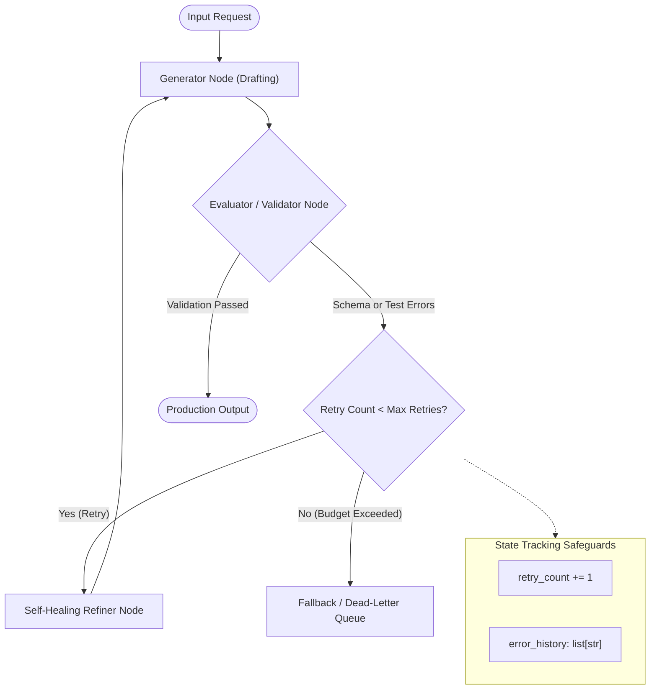

# 🔁 Design Pattern 02: Evaluator-Optimizer & Self-Healing (Reflection)

> **Paper Origin:** *Self-Refine: Iterative Refinement with Self-Feedback* (Madaan et al., NeurIPS 2023) & *Reflexion: Language Agents with Verbal Reinforcement Learning* (Shinn et al., NeurIPS 2023)  
> **Core Principle:** Decoupling output generation from output evaluation to create an iterative, closed-loop refinement cycle that self-corrects errors before production delivery.

---

## 📑 Table of Contents
1. [Executive Summary & Core Concept](#-executive-summary--core-concept)
2. [How the Evaluator-Optimizer Loop Works](#-how-the-evaluator-optimizer-loop-works)
3. [Architectural State Flow](#-architectural-state-flow)
4. [Hybrid Evaluation Strategies (Deterministic + LLM Judge)](#-hybrid-evaluation-strategies)
5. [When to Use (Ideal Use Cases)](#-when-to-use-ideal-use-cases)
6. [When NOT to Use (Anti-Patterns)](#-when-not-to-use-anti-patterns)
7. [Advantages vs. Disadvantages (Engineering Trade-Offs)](#-advantages-vs-disadvantages-engineering-trade-offs)
8. [Production Failure Modes & Mitigations](#-production-failure-modes--mitigations)
9. [Staff/Lead AI Engineer Interview Cheatsheet](#-stafflead-ai-engineer-interview-cheatsheet)

---

## 🎯 Executive Summary & Core Concept

LLMs are notoriously prone to generating outputs with subtle syntax errors, hallucinated fields, or boundary-case failures on the first pass (Zero-Shot).

**The Evaluator-Optimizer pattern** mirrors test-driven software engineering:
1. **Generator Node:** Drafts the initial response or code based on user prompt and constraints.
2. **Evaluator / Critic Node:** Audits the draft against programmatic rules (Pydantic schema, compiler, unit tests) and qualitative criteria (faithfulness, clarity, tone).
3. **Optimizer / Refiner Node:** If evaluation fails, receives the draft *together with explicit error feedback* and produces a targeted correction.

$$\text{Refinement Cycle} = \text{Generate} \longrightarrow \text{Evaluate (Pass/Fail + Feedback)} \longrightarrow \text{Optimize (Targeted Fix)} \longrightarrow \text{Re-Evaluate}$$

---

## ⚙️ How the Evaluator-Optimizer Loop Works

```text
       ┌──────────────────────────────────────────────────────────┐
       │                        User Prompt                       │
       └────────────────────────────┬─────────────────────────────┘
                                    │
                                    ▼
       ┌──────────────────────────────────────────────────────────┐
  ┌───►│ 1. Generator: Drafts candidate code / JSON / report      │
  │    └────────────────────────────┬─────────────────────────────┘
  │                                 │
  │                                 ▼
  │    ┌──────────────────────────────────────────────────────────┐
  │    │ 2. Evaluator: Validates schema, runs linters & tests     │
  │    └────────────────────────────┬─────────────────────────────┘
  │                                 │
  │                     ┌───────────┴───────────┐
  │         [Failures / Errors]             [Passed]
  │                     ▼                       ▼
  │    ┌─────────────────────────────────┐   ┌────────────────────┐
  └───-│ 3. Refiner: Fixes specific bug  │   │ 4. Verified Output │
       │    injected with error trace    │   └────────────────────┘
       └─────────────────────────────────┘
```

### State Transformation Example (Structured JSON Extraction):
1. **Initial Draft by Generator:**
   ```json
   { "company": "Acme Corp", "employees": "around 500", "budget": "$50k" }
   ```
2. **Evaluator (Pydantic Validation Error):**
   ```text
   ValidationError:
   - 'employees': value is not a valid integer ('around 500')
   - 'budget': value is not a valid float ('$50k')
   ```
3. **Refiner Node Prompt with Injected Feedback:**
   *"The previous output failed validation with the following errors: [ValidationError...]. Fix the types and output valid JSON conforming to the schema."*
4. **Refined Output:**
   ```json
   { "company": "Acme Corp", "employees": 500, "budget": 50000.0 }
   ```
5. **Evaluator:** Validation Passed $\longrightarrow$ Route to `END`.

---

## 📐 Architectural State Flow



---

## 🔬 Hybrid Evaluation Strategies

In production, relying solely on an LLM to evaluate another LLM is brittle. High-reliability systems use **Two-Tier Hybrid Evaluation**:

| Evaluation Tier | Implementation Mechanism | Latency | Determinism | Examples |
| :--- | :--- | :--- | :--- | :--- |
| **Tier 1: Deterministic Gates** | Python Code, Pydantic, AST Parsers, Regex, Unit Tests | $<5\text{ms}$ | **100% Deterministic** | JSON syntax validation, SQL AST syntax check, PII filter, Python `pytest`. |
| **Tier 2: Semantic / LLM Judges** | Dedicated LLM call with structured rubric (G-Eval / DeepEval) | $1\text{s} - 2\text{s}$ | **Probabilistic** | Hallucination detection, tone analysis, policy compliance, groundedness against context. |

> [!TIP]
> **Best Practice:** Always run Tier 1 deterministic checks *first*. Only invoke Tier 2 LLM judges if deterministic checks pass, saving latency and token costs.

---

## 🚀 When to Use (Ideal Use Cases)

| Use Case Category | Concrete Example | Why Evaluator-Optimizer Excels |
| :--- | :--- | :--- |
| **Structured Output Extraction** | Complex invoice/contract extraction to strict DB schemas | Pydantic validation guarantees 0% schema breach in downstream APIs. |
| **Code Generation & Self-Correction** | SQL Query Generator, Python Data Analysis scripts | The agent can execute code against a sandbox DB, catch errors, and fix SQL syntax before answering. |
| **Policy Compliance & Safety Audits** | Financial advice / Healthcare summaries | A strict compliance critic node verifies that mandatory disclaimers and regulatory language are present. |
| **High-Precision Translation / Localization** | Translating technical manuals with strict glossary rules | Evaluator verifies that glossary terms were preserved accurately and grammar rules respected. |

---

## 🚫 When NOT to Use (Anti-Patterns)

| Scenario / Anti-Pattern | Why Evaluator-Optimizer Fails | Better Alternative |
| :--- | :--- | :--- |
| **Low-Risk Open Conversational Chat** | Friendly chit-chat, simple greeting, FAQ lookup | Adds unnecessary round-trip latency and 2x–3x cost per message. |
| **Subjective Content Without Measurable Rubrics** | "Write a poem that is creative and inspiring" | Evaluator LLM provides vague, fluctuating feedback leading to endless oscillation. |
| **Latency-Critical Applications (<500ms)** | Real-time gaming NPC, real-time voice streaming | A 2-pass generate-and-validate cycle takes $>2\text{s}$. Use fine-tuned small models. |
| **Unsupervised Code Execution with High Privileges** | Running LLM-generated bash commands on host OS | Self-healing loops could generate destructive commands trying to "fix" permission errors. |

---

## ⚖️ Advantages vs. Disadvantages (Engineering Trade-Offs)

### ✅ Advantages
1. **Dramatic Quality & Reliability Boost:** Increases structured output success rates from ~85% (zero-shot) to >99.5% with 1–2 correction loops.
2. **Explicit Error Localization:** Rather than re-generating from scratch blindly, the refiner receives the exact compiler/schema error trace.
3. **Decoupled Responsibilities:** Generator prompt focuses on creative synthesis; Critic prompt focuses on ruthless rule verification.

### ❌ Disadvantages & Limitations
1. **Multiplied Cost & Latency:** Each retry multiplies token consumption by $2\times$ or $3\times$.
2. **Infinite Correction Loops:** If the model misunderstands a constraint, it may loop repeatedly until timeout.
3. **Critic Blind Spots:** If the Evaluator prompt is flawed, it may approve hallucinated output or reject valid output.

---

## 🛡 Production Failure Modes & Mitigations

### 1. The "Hallucinated Fix" Oscillation
- **Symptom:** The model fixes Error A, but introduces Error B. In the next iteration, it fixes Error B, re-introducing Error A.
- **Production Fix:** Pass the **full `error_history`** to the Refiner node so the model sees past mistakes and avoids cycling between two invalid states.

### 2. Evaluator Sycophancy / Leniency
- **Symptom:** When using an LLM as the Evaluator, it tends to agree with the Generator's draft ("looks good to me!") despite subtle bugs.
- **Production Fix:** 
  - Use **Role Priming:** Instruct the Evaluator that its job is to find flaws: *"You are an adversarial QA auditor. Your goal is to fail this submission if any requirement is violated."*
  - Use a higher-tier reasoning model for evaluation (e.g., GPT-4o / Claude 3.5 Sonnet) while using a smaller model (GPT-4o-mini) for generation.

### 3. Infinite Retry Drain
- **Symptom:** An unachievable constraint causes the agent to burn maximum retries on every single user request.
- **Production Fix:** Enforce `max_retries = 3` with hard fallback: if retries are exhausted, route to a human reviewer or return a graceful failure message.

---

## 🎓 Staff/Lead AI Engineer Interview Cheatsheet

### Q1: How does Evaluator-Optimizer differ from ReAct?
> **Answer:** ReAct is an **exploratory execution loop** (Thought $\rightarrow$ Action $\rightarrow$ Observation) used to gather information from tools dynamically. Evaluator-Optimizer is a **quality-assurance loop** (Generate $\rightarrow$ Critique $\rightarrow$ Refine) used to iteratively improve the quality or compliance of an artifact against a rubric or compiler.

### Q2: What is the optimal retry limit for self-healing loops in production?
> **Answer:** In production, $80\text{--}90\%$ of fixable errors resolve on the **1st retry**, and another $8\text{--}10\%$ resolve on the **2nd retry**. Retrying beyond 3 attempts yields diminishing returns (<1% recovery) while significantly spiking latency and cost. A hard limit of **2 to 3 retries** with a deterministic fallback or DLQ (Dead-Letter Queue) is industry standard.

### Q3: How do you prevent cost explosion in high-volume self-healing pipelines?
> **Answer:**
> 1. Use **Fast/Cheap Models** for generation and reserve larger reasoning models for the Evaluator node.
> 2. Run **Zero-Cost Deterministic Gates** (Pydantic, Regex, AST parsing) before calling any LLM judge.
> 3. Provide **Differential Error Prompts** (only inject the error diff, not the entire conversation history).
