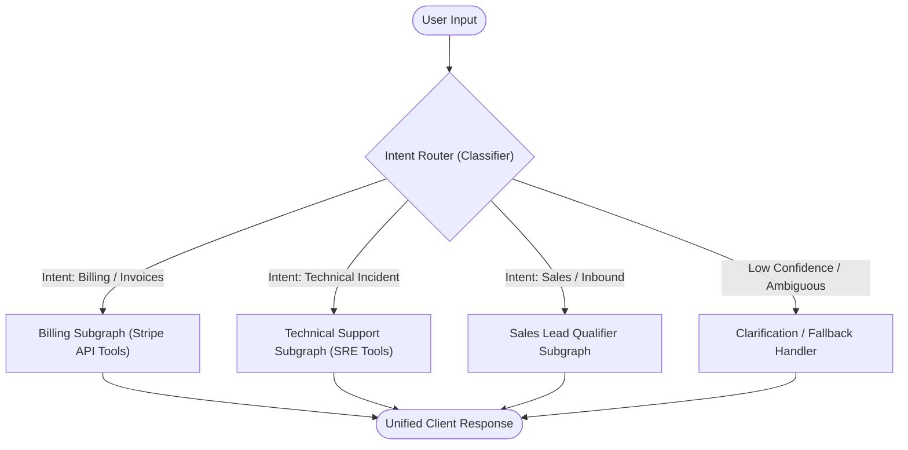

# 🔀 Design Pattern 03: Router & Intent Classifier

> **Core Principle:** Directing incoming user requests to specialized downstream handlers, prompt pipelines, tools, or model tiers based on intent classification.

---

## 📑 Table of Contents
1. [Executive Summary & Core Concept](#-executive-summary--core-concept)
2. [How the Router Pattern Works](#-how-the-router-pattern-works)
3. [Architectural State Flow](#-architectural-state-flow)
4. [The 3 Modern Routing Mechanisms](#-the-3-modern-routing-mechanisms)
5. [When to Use (Ideal Use Cases)](#-when-to-use-ideal-use-cases)
6. [When NOT to Use (Anti-Patterns)](#-when-not-to-use-anti-patterns)
7. [Advantages vs. Disadvantages (Engineering Trade-Offs)](#-advantages-vs-disadvantages-engineering-trade-offs)
8. [Production Failure Modes & Mitigations](#-production-failure-modes--mitigations)
9. [Staff/Lead AI Engineer Interview Cheatsheet](#-stafflead-ai-engineer-interview-cheatsheet)

---

## 🎯 Executive Summary & Core Concept

Monolithic "Swiss Army Knife" agents suffer from:
- **Prompt Bloat:** Trying to pack instructions for 20 different domains into a single system prompt.
- **Tool Confusion:** Exposing dozens of tools simultaneously degrades LLM tool-calling accuracy.
- **Cost Inefficiency:** Using an expensive frontier model for trivial queries that a cheap model or cache could answer.

**The Router Pattern** solves this by inserting an intelligent dispatch gate at the system boundary. It classifies the input intent and routes the state to an **isolated, domain-specialized handler** with tailored prompts, specific tools, and the optimal model tier.

$$\text{Incoming Query} \xrightarrow{\quad\text{Router}\quad} \text{Intent Class } k \longrightarrow \text{Specialized Subgraph } S_k$$

---

## ⚙️ How the Router Pattern Works

```text
                               ┌───────────────────────────┐
                               │        User Query         │
                               └─────────────┬─────────────┘
                                             │
                                             ▼
                               ┌───────────────────────────┐
                               │    Router / Classifier    │
                               └─────────────┬─────────────┘
                                             │
             ┌───────────────────────────────┼──────────────────────────────┐
             │ [billing]                     │ [tech_support]               │ [fallback / general]
             ▼                               ▼                              ▼
┌──────────────────────────┐   ┌──────────────────────────┐   ┌──────────────────────────┐
│  Billing Specialist      │   │  Technical Support Agent │   │  General FAQ Handler     │
│  - System: Billing Rules │   │  - System: Code/Log Sys  │   │  - System: Lightweight   │
│  - Tools: Stripe API     │   │  - Tools: Datadog, Logs  │   │  - Tools: Knowledge Base │
│  - Model: GPT-4o-mini    │   │  - Model: Claude Sonnet  │   │  - Model: Semantic Cache │
└────────────┬─────────────┘   └─────────────┬────────────┘   └─────────────┬────────────┘
             │                               │                              │
             └───────────────────────────────┼──────────────────────────────┘
                                             ▼
                               ┌───────────────────────────┐
                               │      Final Response       │
                               └───────────────────────────┘
```

---

## 📐 Architectural State Flow



---

## 🔬 The 3 Modern Routing Mechanisms

In production, routing is implemented across 3 distinct tiers depending on latency and complexity budgets:

| Routing Tier | Mechanism | Latency | Cost | Accuracy & Nuance | Best Used For |
| :--- | :--- | :--- | :--- | :--- | :--- |
| **1. Semantic Vector Router** | Cosine similarity against centroid embeddings of sample utterances (e.g. *Semantic Router*) | $\approx 10\text{ms}$ | **Free / ~$0** | High on known clusters; weak on edge cases | High-throughput FAQs, direct intent shortcuts, greetings. |
| **2. Small LLM Structured Classifier** | Lightweight LLM (e.g. `gpt-4o-mini`, `gemini-2.0-flash`) emitting Pydantic Enum | $200\text{--}400\text{ms}$ | **Very Low** | **Very High** (handles ambiguity, context, and nuance) | Multi-turn enterprise customer service, complex routing. |
| **3. Model Tier Router (Cost Routing)** | Evaluates prompt complexity/reasoning requirements to choose Model Tier | $150\text{--}300\text{ms}$ | **Net Savings** | High | Routing simple prompts to 4o-mini and complex math/coding to o1/Claude 3.5 Sonnet. |

---

## 🚀 When to Use (Ideal Use Cases)

| Use Case Category | Concrete Example | Why Routing is the Right Choice |
| :--- | :--- | :--- |
| **Multi-Department Enterprise Support** | Enterprise portal handling HR, IT Support, Payroll, and Legal inquiries | Keeps HR tools isolated from IT tools, preventing accidental cross-tool pollution and data leaks. |
| **Cost & Latency Optimization (Model Cascades)** | SaaS assistant routing 80% simple queries to fast models and 20% complex logic to reasoning models | Drops overall API bills by 60–75% while maintaining top-tier quality where needed. |
| **Language / Region Routing** | Multilingual global support (English, Japanese, German, Spanish) | Routes directly to localized system prompts and regional regulatory knowledge bases. |
| **Guardrail / Security Triage** | Security Gateway checking for jailbreaks, PII, or prompt injections | Intercepts adversarial input before it ever touches costly downstream agent graphs. |

---

## 🚫 When NOT to Use (Anti-Patterns)

| Scenario / Anti-Pattern | Why Routing Fails | Better Alternative |
| :--- | :--- | :--- |
| **Single-Domain Tasks** | A dedicated Python code generator | Unnecessary layer of latency; user is always asking for code. |
| **Compound Multi-Domain Queries** | *"Show my invoice for last month and fix the bug in my API integration."* | A strict 1-to-1 router forces an artificial choice. Use **Planner-Executor** to split compound queries. |
| **Continuous Unstructured Conversations** | Open-ended brainstorming / freeform research | Intent shifts dynamically every sentence; static upfront routing creates brittle friction. |

---

## ⚖️ Advantages vs. Disadvantages (Engineering Trade-Offs)

### ✅ Advantages
1. **Prompt & Tool Specialization:** Each downstream worker agent has a focused prompt and $\le 5$ relevant tools, maximizing tool-calling accuracy.
2. **Reduced Latency & Token Usage:** Downstream agents do not carry irrelevant prompt instructions from other domains.
3. **Independent Team Ownership:** The Billing team can update the Billing Subgraph without breaking or redeploying the Tech Support Subgraph.
4. **Enhanced Security & RBAC:** Restricts sensitive tools (e.g., refunds, DB writes) strictly to authorized routing paths.

### ❌ Disadvantages & Limitations
1. **Misrouting Cascade:** If the router misclassifies a query, the downstream agent receives an irrelevant task and either fails or hallucinates.
2. **Compound Request Bottleneck:** Fails gracefully handling requests that span multiple intents without subtask decomposition.
3. **Routing Latency Overhead:** Adds an extra classification hop before the actual work begins.

---

## 🛡 Production Failure Modes & Mitigations

### 1. Misrouting on Ambiguous Queries
- **Symptom:** User says: *"My account is locked and I can't pay my bill."* Router sends to Billing, but the root cause is IT Authentication.
- **Production Fix:** 
  - Compute a **Confidence Score** for the top prediction. If confidence is below a threshold (e.g., $<0.75$), route to a **Clarification Node** that asks: *"Are you looking for help unlocking your account or paying your invoice?"*

### 2. The Multi-Intent Deadlock
- **Symptom:** User submits two intents in one prompt. Router picks the first and ignores the second.
- **Production Fix:** Allow the classifier to return a `list[IntentEnum]`. If `len(intents) > 1`, route to a **Decomposition / Orchestration Agent** instead of a single specialist.

---

## 🎓 Staff/Lead AI Engineer Interview Cheatsheet

### Q1: How do you choose between Semantic Vector Routing and LLM Structured Routing?
> **Answer:** Choose **Semantic Vector Routing** (e.g. embeddings + cosine similarity) when latency is critical ($<20\text{ms}$ budget), intents are static, and queries are short single-turn keywords. Choose **LLM Structured Output Routing** (Pydantic Enum) when routing depends on conversational history, complex reasoning, negation (e.g. *"I don't want a refund, I want to cancel"*), or compound intent detection.

### Q2: How do you measure and benchmark Router performance in production?
> **Answer:** Treat the Router as a multi-class classification model. Maintain a golden dataset of user queries and compute **Macro-F1 score, Precision, and Recall per intent class**. Monitor **Fallback Rate** (how often confidence falls below threshold) and **Agent Re-route Rate** (how often a downstream specialist rejects the task).
