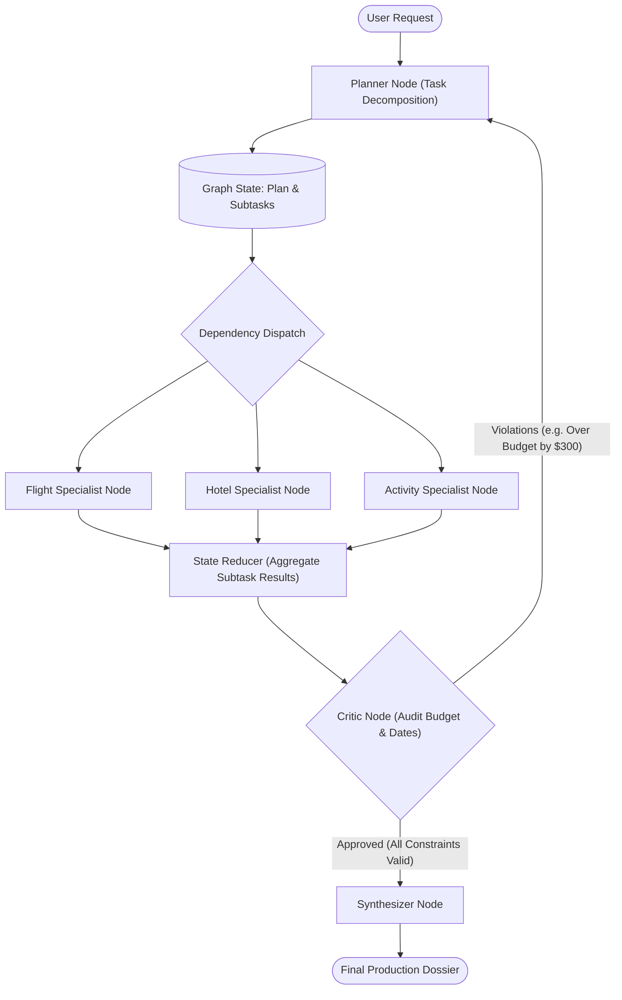

# 📋 Design Pattern 04: Planner–Executor–Critic (Plan-and-Solve)

> **Paper Origin:** *Plan-and-Solve Prompting: Improving Zero-Shot Chain-of-Thought Reasoning by Large Language Models* (Wang et al., ACL 2023)  
> **Core Principle:** Decomposing complex, ambiguous objectives into an explicit Directed Acyclic Graph (DAG) of subtasks, executing subtasks across specialized workers, and auditing the aggregated outcome against hard constraints via a Critic before final synthesis.

---

## 📑 Table of Contents
1. [Executive Summary & Core Concept](#-executive-summary--core-concept)
2. [How Planner-Executor-Critic Works Under the Hood](#-how-planner-executor-critic-works-under-the-hood)
3. [Architectural State Flow](#-architectural-state-flow)
4. [Plan Representation & Dependency Management](#-plan-representation--dependency-management)
5. [When to Use (Ideal Use Cases)](#-when-to-use-ideal-use-cases)
6. [When NOT to Use (Anti-Patterns)](#-when-not-to-use-anti-patterns)
7. [Advantages vs. Disadvantages (Engineering Trade-Offs)](#-advantages-vs-disadvantages-engineering-trade-offs)
8. [Production Failure Modes & Mitigations](#-production-failure-modes--mitigations)
9. [Staff/Lead AI Engineer Interview Cheatsheet](#-stafflead-ai-engineer-interview-cheatsheet)

---

## 🎯 Executive Summary & Core Concept

When an agent is asked to solve a multifaceted problem (e.g. *"Plan a 7-day multi-city trip across Japan with a $4,000 budget including flights, hotels, and bullet trains"*), standard single-agent ReAct loops frequently fail due to:
- **Greedy Local Optimization:** Booking an expensive flight first, leaving insufficient budget for lodging.
- **Context Overload:** Losing track of overall timeline constraints as the conversation context fills up.
- **No Global Validation:** Delivering an itinerary with schedule overlaps or budget breaches.

**The Planner–Executor–Critic pattern** resolves this by separating concerns:
1. **Planner Agent:** Creates a structured, dependency-aware plan (a list of subtasks).
2. **Executor Agents:** Specialized worker nodes execute subtasks (often in parallel).
3. **Critic Agent:** Audits the aggregated results against global hard constraints (budget, dates, feasibility).
4. **Synthesizer Agent:** Assembles the verified outputs into a polished deliverable.

$$\text{Workflow} = \text{Plan (Decompose)} \longrightarrow \text{Execute (Parallel Specialists)} \longrightarrow \text{Critic (Audit Constraints)} \longrightarrow \text{Synthesize}$$

---

## ⚙️ How Planner-Executor-Critic Works Under the Hood

```text
       ┌──────────────────────────────────────────────────────────┐
       │                 Complex User Objective                   │
       └────────────────────────────┬─────────────────────────────┘
                                    │
                                    ▼
       ┌──────────────────────────────────────────────────────────┐
  ┌───►│ 1. Planner Node: Generates structured Subtask DAG        │
  │    └────────────────────────────┬─────────────────────────────┘
  │                                 │
  │               ┌─────────────────┴─────────────────┐
  │         (Parallel Dispatch to Specialized Workers)│
  │               ▼                                   ▼
  │    ┌──────────────────────┐            ┌──────────────────────┐
  │    │ Flight Specialist    │            │ Hotel Specialist     │
  │    │ - Task: Find routes  │            │ - Task: Find lodging │
  │    └──────────┬───────────┘            └──────────┬───────────┘
  │               │                                   │
  │               └─────────────────┬─────────────────┘
  │                                 ▼
  │    ┌──────────────────────────────────────────────────────────┐
  │    │ 2. Aggregate Results in Shared Graph State               │
  │    └────────────────────────────┬─────────────────────────────┘
  │                                 │
  │                                 ▼
  │    ┌──────────────────────────────────────────────────────────┐
  │    │ 3. Critic Node: Validates budget, dates, and feasibility │
  │    └────────────────────────────┬─────────────────────────────┘
  │                                 │
  │                     ┌───────────┴───────────┐
  │        [Constraint Violations]          [Constraints Met]
  │                     │                       │
  └─────────────────────┘                       ▼
                                   ┌──────────────────────────────┐
                                   │ 4. Synthesizer Node: Final   │
                                   │    Structured Travel Dossier │
                                   └──────────────────────────────┘
```

---

## 📐 Architectural State Flow



---

## 📋 Plan Representation & Dependency Management

In production, plans are not free-form text; they are modeled with **Pydantic schemas**:

```python
from pydantic import BaseModel, Field
from typing import List, Optional
from enum import Enum

class TaskStatus(str, Enum):
    PENDING = "pending"
    IN_PROGRESS = "in_progress"
    COMPLETED = "completed"
    FAILED = "failed"

class Subtask(BaseModel):
    id: str = Field(description="Unique task identifier, e.g. 'task_flight'")
    description: str = Field(description="Actionable goal of this subtask")
    assigned_agent: str = Field(description="Target agent: 'flight_specialist', 'hotel_specialist'")
    dependencies: List[str] = Field(default_factory=list, description="IDs of tasks that must finish first")
    status: TaskStatus = TaskStatus.PENDING
    result: Optional[str] = None

class Plan(BaseModel):
    objective: str
    total_budget_limit: float
    subtasks: List[Subtask]
    revision_count: int = 0
```

---

## 🚀 When to Use (Ideal Use Cases)

| Use Case Category | Concrete Example | Why Planner-Executor-Critic Excels |
| :--- | :--- | :--- |
| **Complex Travel & Logistics Planning** | Multi-city itineraries with flights, hotels, and train transfers | Allows parallel flight/hotel lookups while the Critic ensures dates align and budget is respected. |
| **Deep Research & Competitive Intelligence** | Generating a 20-page market analysis on 5 competitors | Breaks research into 5 independent parallel competitor tracks, followed by a Critic verifying factual depth. |
| **Multi-File Software Refactoring** | Migrating an API from Flask to FastAPI across 15 endpoints | Planner maps dependency order; executor updates files; Critic runs test suite before commit. |
| **Financial Wealth Portfolio Rebalancing** | Asset allocation across equities, fixed income, and commodities | Critic audits portfolio risk metrics against investor risk profile and tax liability. |

---

## 🚫 When NOT to Use (Anti-Patterns)

| Scenario / Anti-Pattern | Why Planner-Executor-Critic Fails | Better Alternative |
| :--- | :--- | :--- |
| **Single-Step / Simple Inquiries** | *"What is the exchange rate from USD to EUR?"* | Overkill: generating a plan, dispatching workers, and running a critic adds 5–10s of wasted latency. Use **ReAct / Tool-Loop**. |
| **Low-Latency Streaming Responses** | Real-time interactive chatbots, voice assistants | Upfront planning and multi-stage evaluation cannot stream initial tokens immediately. |
| **Uncertain Exploratory Environments** | Debugging an unknown production server issue | The scope cannot be planned upfront because subtasks depend on runtime discovery. Use **ReAct**. |

---

## ⚖️ Advantages vs. Disadvantages (Engineering Trade-Offs)

### ✅ Advantages
1. **Parallel Execution (Fan-Out / Fan-In):** Independent subtasks execute concurrently, dramatically reducing wall-clock execution time compared to sequential loops.
2. **Global Constraint Optimization:** The Critic evaluates the *integrated picture*, preventing local decisions from breaking overall budgets or SLAs.
3. **Structured Traceability:** Every subtask has explicit input/output records, making complex reasoning workflows easy to monitor in LangSmith.
4. **Resilience & Modular Recovery:** If one subtask fails, the Planner only needs to re-run the failed subtask rather than restarting the entire workflow.

### ❌ Disadvantages & Limitations
1. **High Upfront Latency:** Takes several seconds before the first worker even begins executing.
2. **Planning Hallucination / Over-Engineering:** The Planner may generate redundant, overly granular, or impossible subtasks.
3. **Re-planning Cost Spikes:** If the Critic frequently rejects results, repeated re-planning loops rapidly consume tokens.

---

## 🛡 Production Failure Modes & Mitigations

### 1. The "Over-Planning Paralysis" Mode
- **Symptom:** The Planner creates 25 hyper-specific micro-tasks for a simple inquiry, causing slow execution and high token overhead.
- **Production Fix:** Constrain the Planner prompt: *"Generate no more than 3 to 5 high-impact, independent subtasks."*

### 2. Plan Drift & Deadlock
- **Symptom:** Worker Agent outputs contradict the Planner's original intent, or cyclic dependencies stall execution.
- **Production Fix:**
  - Enforce topological sorting validation on subtask dependency IDs.
  - Reject cyclic dependencies programmatically before dispatching workers.

### 3. Infinite Rejection by Critic
- **Symptom:** The Critic has unrealistic constraints (e.g., finding a 5-star Tokyo hotel for $30/night) and continuously rejects valid plans.
- **Production Fix:**
  - Cap critic revisions at `max_revisions = 2`.
  - On final revision, instruct the Critic to relax non-essential constraints and synthesize a "Best Effort with Disclaimers" report.

---

## 🎓 Staff/Lead AI Engineer Interview Cheatsheet

### Q1: How does LangGraph handle parallel execution in the Planner-Executor pattern?
> **Answer:** In LangGraph, when a node (or conditional router) returns multiple edges leading to different worker nodes, LangGraph executes those worker nodes **concurrently via `asyncio`**. Their outputs are combined back into the shared state using **State Reducers** (e.g. `Annotated[list, operator.add]`), ensuring thread-safe state aggregation before the Critic node fires.

### Q2: What is the difference between Static Planning and Dynamic Re-planning?
> **Answer:** In **Static Planning**, the plan is generated once and executed without modification. In **Dynamic Re-planning**, if a worker encounters a blocker (e.g. a flight is sold out or an API is down), the state returns to the Planner to adjust the remaining unexecuted subtasks without losing completed work.

### Q3: How do you prevent the Critic from being overly harsh or causing cost loops?
> **Answer:** Provide the Critic with a structured rubric containing **Hard Constraints** (e.g. Total Cost $\le \$4,000$) and **Soft Preferences** (e.g. Hotel near subway). The Critic only triggers a re-plan on Hard Constraint violations, while soft preferences are handled via annotations passed to the Synthesizer.
