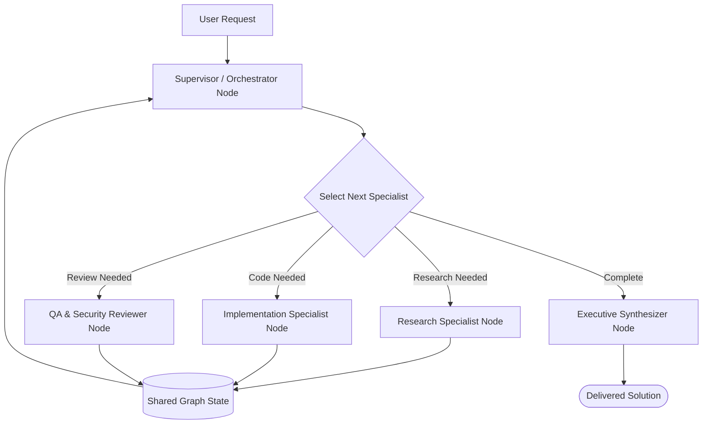

# 👥 Design Pattern 05: Multi-Agent Collaboration & Networked Teams

> **Core Principle:** Distributing complex, multi-domain cognitive workloads across specialized, autonomous agent roles coordinated through explicit graph topologies and shared state contracts.

---

## 📑 Table of Contents
1. [Executive Summary & Core Concept](#-executive-summary--core-concept)
2. [Multi-Agent Collaboration Topologies](#-multi-agent-collaboration-topologies)
3. [Architectural State Flow](#-architectural-state-flow)
4. [Communication & Handoff Mechanics](#-communication--handoff-mechanics)
5. [When to Use (Ideal Use Cases)](#-when-to-use-ideal-use-cases)
6. [When NOT to Use (Anti-Patterns)](#-when-not-to-use-anti-patterns)
7. [Advantages vs. Disadvantages (Engineering Trade-Offs)](#-advantages-vs-disadvantages-engineering-trade-offs)
8. [Production Failure Modes & Mitigations](#-production-failure-modes--mitigations)
9. [Staff/Lead AI Engineer Interview Cheatsheet](#-stafflead-ai-engineer-interview-cheatsheet)

---

## 🎯 Executive Summary & Core Concept

When a single LLM tries to simultaneously act as a **domain researcher**, a **senior software engineer**, a **security auditor**, and an **executive copywriter**, it suffers from:
- **Role Dilution:** Competing prompt guidelines degrade output precision across all tasks.
- **Context Pollution:** Intermediate research notes, raw API dumps, and debug logs dilute the model's attention for code generation.
- **Prompt Fragility:** Editing the prompt to improve one persona breaks another.

**Multi-Agent Collaboration** applies software engineering's *Single Responsibility Principle (SRP)* to LLMs. Each agent operates with:
- A dedicated, compact system prompt.
- An isolated, domain-specific toolset.
- A standardized communication interface (LangGraph State / Message Bus).

$$\text{Team Solution} = \text{Orchestrator} \xrightarrow{\text{delegate}} \sum_{i=1}^N \text{Specialist Agent}_i(\text{Role}_i, \text{Tools}_i, \text{State})$$

---

## 🏗 Multi-Agent Collaboration Topologies

In modern AI architecture, multi-agent teams are organized into 4 primary topologies:

| Topology Pattern | Structural Flow | Communication Style | Best Used For |
| :--- | :--- | :--- | :--- |
| **1. Hierarchical (Supervisor / Orchestrator)** | Central Supervisor delegates to Workers; workers report back | Centralized routing via Supervisor node | Enterprise workflows, customer service, structured task delegation. |
| **2. Sequential Assembly Line** | Agent A $\longrightarrow$ Agent B $\longrightarrow$ Agent C | Linear state mutation pipeline | Content creation (Draft $\rightarrow$ Fact-Check $\rightarrow$ SEO $\rightarrow$ Publish). |
| **3. Collaborative Debate / Consensus** | Agent A $\longleftrightarrow$ Agent B (Critique & Counter) | Round-robin / Peer review | Algorithmic trading analysis, legal contract vetting, code reviews. |
| **4. Networked Peer-to-Peer (A2A / MCP)** | Agents discover and call each other over typed protocol | Decentralized message bus | Inter-organization agent communication, market negotiation. |

---

## 📐 Architectural State Flow (Hierarchical Multi-Agent Team)



---

## 🔄 Communication & Handoff Mechanics

In LangGraph, multi-agent collaboration relies on **Shared TypedDict State** and **State Reducers**:

```python
from typing import TypedDict, Annotated, List, Optional
import operator
from langchain_core.messages import BaseMessage

class MultiAgentState(TypedDict):
    # Appends new messages from any agent without overwriting history
    messages: Annotated[List[BaseMessage], operator.add]
    next_step: str
    research_summary: Optional[str]
    code_artifact: Optional[str]
    qa_review_notes: Optional[str]
    is_approved: bool
    iteration_count: int
```

### Handoff Patterns:
1. **Supervisor Router Pattern:** The Supervisor LLM selects `next_step: "researcher" | "coder" | "reviewer" | "FINISH"`.
2. **Explicit Handoff Tool Pattern:** An active agent invokes a `transfer_to_coder(reason="Research complete")` tool call.

---

## 🚀 When to Use (Ideal Use Cases)

| Use Case Category | Concrete Example | Why Multi-Agent Collaboration Wins |
| :--- | :--- | :--- |
| **End-to-End Software Feature Development** | Specification $\rightarrow$ Implementation $\rightarrow$ Test Writing $\rightarrow$ Security Audit | Isolates the coder from test writer, preventing the coder from "grading its own homework." |
| **Multi-Source Financial & Market Synthesis** | Equities Analyst + Macro Economist + Risk Officer | Synthesizes conflicting market perspectives into a balanced executive briefing. |
| **Automated Incident Triage & Remediation** | Log Analyzer Agent + DB Specialist + Infra SRE Agent | Concurrently investigates logs, database locks, and Kubernetes events to diagnose outages. |
| **Complex Legal Contract Negotiation** | Buyer Counsel Agent vs. Seller Counsel Agent | Models adversarial multi-party negotiation with explicit trade-off boundaries. |

---

## 🚫 When NOT to Use (Anti-Patterns)

| Scenario / Anti-Pattern | Why Multi-Agent Fails or Over-Engineers | Better Alternative |
| :--- | :--- | :--- |
| **Simple Linear Tasks** | Summarizing a meeting transcript | Spawning 4 agents (Summarizer, Formatter, Proofreader, Polisher) multiplies latency $4\times$ and cost $4\times$ with zero quality gain. Use a single prompt. |
| **Tight Real-Time Latency Budgets (<1s)** | Interactive Voice / Chatbot auto-response | Multi-agent coordination hops require multiple LLM roundtrips ($>4\text{s}$). |
| **Homogeneous Tasks** | Processing 10,000 independent customer emails | Do not use a collaborative agent team; use **Async Batching with a single worker**. |

---

## ⚖️ Advantages vs. Disadvantages (Engineering Trade-Offs)

### ✅ Advantages
1. **Modular Maintainability:** Prompts, tools, and model choices are decoupled per agent. Upgrading the *Coder* model does not break the *Reviewer*.
2. **Specialized Model Tiering:** Assign `Claude 3.5 Sonnet` to the Coder for high intelligence and `GPT-4o-mini` to the Summarizer for speed and low cost.
3. **Adversarial Rigor:** Separate Reviewer/Critic agents catch bugs and hallucinations that the authoring agent was blind to.
4. **Reusable Subgraphs:** An entire Multi-Agent Code Review subgraph can be embedded into multiple enterprise pipelines.

### ❌ Disadvantages & Limitations
1. **High Token & Dollar Cost:** Multi-agent dialogue exponentially increases message history and token usage.
2. **Coordination Overhead & Latency:** Each handoff requires an LLM orchestration decision ($1\text{s} - 2\text{s}$ per turn).
3. **Infinite Banter & Loop Deadlocks:** Agents can get stuck politely passing the task back and forth without terminating.

---

## 🛡 Production Failure Modes & Mitigations

### 1. The "Infinite Banter" Loop
- **Symptom:** Agent A says: *"Here is the draft, please review."* Agent B says: *"Looks good, but please double check X."* Agent A says: *"I checked X, what do you think?"*
- **Production Fix:**
  - Enforce a **Hard Iteration Cap** (`iteration_count <= 5`).
  - Require the Reviewer agent to output a binary structured verdict: `approved: bool` with actionable fix requirements.

### 2. Context History Explosion
- **Symptom:** The shared message list grows to 50,000 tokens, causing high inference cost and context dilution.
- **Production Fix:** 
  - Use **State Filtering / Message Pruning:** Rather than passing the raw message log to every agent, have each agent write structured summary fields (`state["research_notes"]`) to graph state.

---

## 🎓 Staff/Lead AI Engineer Interview Cheatsheet

### Q1: What are the differences between LangGraph, CrewAI, and AutoGen for multi-agent systems?
> **Answer:** 
> - **LangGraph:** Production-first, deterministic state-machine framework with full control over graph edges, checkpoints, state persistence, and HITL. Best for enterprise engineering.
> - **CrewAI:** Opinionated, role-playing framework (Crews, Tasks, Processes) with fast setup but less fine-grained control over low-level state transitions.
> - **AutoGen:** Microsoft's conversational multi-agent framework optimized for open-ended multi-agent chat and code execution loops.

### Q2: How do you prevent state race conditions when multiple agents run concurrently in LangGraph?
> **Answer:** LangGraph solves this using **State Reducers** (e.g. `Annotated[list, operator.add]` or custom reducer functions). When parallel worker nodes return updates, LangGraph applies the reducer deterministically to merge updates into the shared state object before passing it to the next node.

### Q3: When should you use Shared Graph State vs. Message Passing over Network Protocols (A2A/MCP)?
> **Answer:** Use **Shared Graph State (LangGraph)** when all agents run within the **same application/process boundary** with low latency and high data sharing. Use **Network Protocols (A2A / MCP)** when agents belong to **different services, teams, or external organizations** requiring network boundaries, strict authorization, and protocol compliance.
