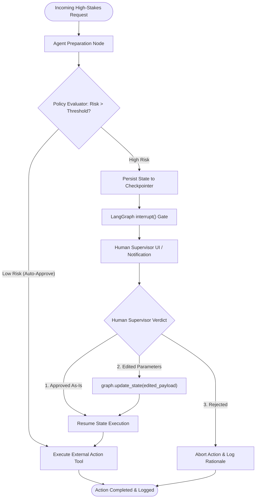

# 🧑‍💻 Design Pattern 06: Human-in-the-Loop (HITL)

> **Core Principle:** Safely pausing autonomous agent execution before irreversible or high-stakes actions, persisting graph state via checkpointers, collecting human approval or state edits, and seamlessly resuming execution.

---

## 📑 Table of Contents
1. [Executive Summary & Core Concept](#-executive-summary--core-concept)
2. [The 3 Core HITL Interaction Patterns](#-the-3-core-hitl-interaction-patterns)
3. [How LangGraph HITL Works Under the Hood](#-how-langgraph-hitl-works-under-the-hood)
4. [Architectural State Flow](#-architectural-state-flow)
5. [When to Use (Ideal Use Cases)](#-when-to-use-ideal-use-cases)
6. [When NOT to Use (Anti-Patterns)](#-when-not-to-use-anti-patterns)
7. [Advantages vs. Disadvantages (Engineering Trade-Offs)](#-advantages-vs-disadvantages-engineering-trade-offs)
8. [Production Failure Modes & Mitigations](#-production-failure-modes--mitigations)
9. [Staff/Lead AI Engineer Interview Cheatsheet](#-stafflead-ai-engineer-interview-cheatsheet)

---

## 🎯 Executive Summary & Core Concept

Autonomous agents excel at research, draft generation, and routine lookups. However, in enterprise settings, granting agents unconstrained autonomy to execute **irreversible side-effects** (e.g. charging credit cards, deleting database records, emailing 10,000 customers, signing contracts) is an unacceptable business risk.

**Human-in-the-Loop (HITL)** establishes a deterministic safety boundary:
- The agent prepares the action payload autonomously.
- A policy gate evaluates the risk tier.
- If high risk, the state machine **pauses and persists its snapshot** to a database checkpointer.
- A human supervisor reviews, edits, or rejects the action via UI/API.
- The workflow resumes with the verified state.

$$\text{Action Execution} = \text{Agent Drafts Action} \xrightarrow{\text{Policy Trigger}} \text{Pause \& Checkpoint} \xrightarrow{\text{Human Verdict}} \text{Resume Execution}$$

---

## 🚦 The 3 Core HITL Interaction Patterns

| HITL Pattern | Human Role | State Mutation | Real-World Example |
| :--- | :--- | :--- | :--- |
| **1. Approve / Reject (Gatekeeper)** | Binary Decision (Yes / No) | State remains unchanged; execution either proceeds to execution node or aborts. | Confirming a wire transfer $> \$1,000$. |
| **2. Review-and-Edit (Co-Pilot)** | Human inspects and edits parameters before execution | Human edits the proposed payload (e.g., changing discount % or adjusting email wording). | Support agent drafts a refund of \$80; supervisor reduces it to \$50 before approval. |
| **3. Dynamic Interrupt & Steer** | Human injects new state or guidance mid-workflow | Injects new instructions or context into `messages` history; routes back to Planner. | Human notices agent is researching wrong competitor and redirects it to the correct one. |

---

## ⚙️ How LangGraph HITL Works Under the Hood

LangGraph implements HITL natively using **Checkpointers** (`MemorySaver`, `PostgresSaver`, or `SqliteSaver`) and the `interrupt()` primitive:

```text
1. Client starts workflow with unique thread_id:
   config = {"configurable": {"thread_id": "session_123"}}
   graph.invoke(initial_input, config)

2. Graph executes Nodes 1 -> 2 -> Node 3 (calls interrupt({...}))
   - LangGraph serializes current state to Postgres/Memory checkpointer.
   - Graph execution freezes and yields control back to API/UI.

3. Frontend UI queries state snapshot:
   state = graph.get_state(config)
   # UI renders approval modal with state.values["pending_action"]

4. Human supervisor approves or edits:
   # (Optional edit)
   graph.update_state(config, {"action_payload": {"amount": 50.0}})
   
   # Resume execution from checkpoint:
   graph.invoke(None, config)
```

---

## 📐 Architectural State Flow



---

## 🚀 When to Use (Ideal Use Cases)

| Use Case Category | Concrete Example | Why HITL is Mandatory |
| :--- | :--- | :--- |
| **Financial Payouts & Billing Actions** | Processing enterprise refunds $> \$500$ or credit limit adjustments | Regulatory compliance and financial loss prevention. |
| **Destructive Data Operations** | Deleting databases, terminating EC2 instances, modifying IAM roles | Prevents catastrophic outages caused by LLM hallucination. |
| **Customer-Facing Mass Communications** | Sending marketing campaigns or incident notifications to 10,000+ users | Brand safety and tone verification. |
| **Clinical / Legal Decision Support** | Drafting medical diagnosis summaries or legal court filings | Liability, ethics, and healthcare compliance. |

---

## 🚫 When NOT to Use (Anti-Patterns)

| Scenario / Anti-Pattern | Why HITL Fails | Better Alternative |
| :--- | :--- | :--- |
| **High-Throughput / Low-Latency Endpoints** | Answering 50,000 real-time search queries per minute | Human review creates an impossible operational bottleneck. Use **Deterministic Guardrails & Automated Evals**. |
| **Low-Risk Read-Only Inquiries** | *"What time does the store open?"* | Adds friction and defeats the purpose of automation. |
| **Unresponsive / Ephemeral Sessions** | Real-time interactive voice streaming without async session storage | Freezing a voice call for 10 minutes while waiting for a manager kills UX. |

---

## ⚖️ Advantages vs. Disadvantages (Engineering Trade-Offs)

### ✅ Advantages
1. **Zero Unintended Side-Effects:** Eliminates rogue model actions on high-stakes infrastructure.
2. **Safe Co-Pilot Collaboration:** Combines LLM drafting speed with human judgment.
3. **Audit Trail & Governance:** Every state checkpoint, human edit, and approval timestamp is recorded in Postgres for regulatory compliance.
4. **Time-Traveling & Rollback:** Checkpointers allow operators to rewind an agent to an earlier step and replay with different decisions.

### ❌ Disadvantages & Limitations
1. **Asynchronous Architecture Complexity:** Requires checkpointer persistence, background worker queues (Celery/Temporal), and webhook notifications.
2. **Operational Human Cost:** Requires a staffed supervisor queue; slow human response times spike end-to-end task turnaround.
3. **Session Expiry & Stale State:** If a human takes 48 hours to approve an order, the item price or inventory status may have changed in the real world.

---

## 🛡 Production Failure Modes & Mitigations

### 1. Stale State Execution on Delayed Approval
- **Symptom:** Human approves an airline ticket booking 6 hours later, but the flight price changed or seats sold out.
- **Production Fix:** Implement a **Pre-Execution Re-validation Hook** right after resumption to verify that external prerequisites are still valid before executing the side-effect.

### 2. Supervisor Queue Abandonment
- **Symptom:** A critical request sits in an approval queue indefinitely because the manager is out of office.
- **Production Fix:** Implement **SLA Timeouts with Auto-Escalation**: If unreviewed after 30 minutes, escalate to a secondary reviewer or auto-abort and notify the requester.

---

## 🎓 Staff/Lead AI Engineer Interview Cheatsheet

### Q1: How does LangGraph maintain state during an interrupt without keeping a Python process alive?
> **Answer:** LangGraph serializes the entire `State` dictionary into a persistent **Checkpointer (Postgres / SQLite)** keyed by `thread_id` and `checkpoint_id`. Once `interrupt()` is reached, the worker thread terminates completely. When the human approves via API, any available backend worker loads the state from Postgres by `thread_id` and resumes execution from the exact next node.

### Q2: What is the difference between Optimistic Gating and Pessimistic Gating?
> **Answer:** In **Pessimistic Gating**, execution *always halts* before the action node until explicit approval is granted. In **Optimistic Gating**, the system executes low-risk actions immediately and only triggers an approval halt if automated heuristics (e.g. transaction value $> \$1,000$, new user account, low model confidence) flag high risk.

### Q3: How do you handle State Editing during HITL in LangGraph?
> **Answer:** Use `graph.update_state(config, values={"key": "new_val"}, as_node="node_name")`. This creates a new checkpoint fork that overwrites specific state values while preserving the full historical audit log.
