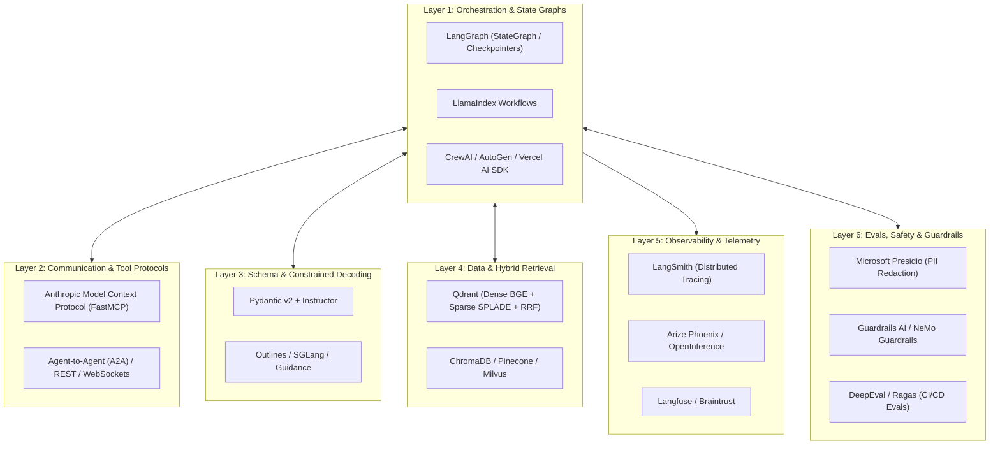

# 🏢 Industry-Standard Libraries & Frameworks for Agentic AI

A comprehensive architectural reference guide to modern frameworks, tool protocols, schema enforcers, observability platforms, and safety engines across the Agentic AI lifecycle.

---

## 📑 Table of Contents
1. [Executive Summary & Architectural Taxonomy](#-executive-summary--architectural-taxonomy)
2. [1. Agent Orchestration & Multi-Agent Frameworks](#1-agent-orchestration--multi-agent-frameworks)
3. [2. Agent Communication & Tool Protocols (MCP & A2A)](#2-agent-communication--tool-protocols-mcp--a2a)
4. [3. Structured Output & Constrained Generation](#3-structured-output--constrained-generation)
5. [4. Observability, Distributed Tracing & Telemetry](#4-observability-distributed-tracing--telemetry)
6. [5. Evaluation, Safety Guardrails & PII Sanitization](#5-evaluation-safety-guardrails--pii-sanitization)
7. [6. Vector Databases & Hybrid Retrieval Engines](#6-vector-databases--hybrid-retrieval-engines)
8. [7. Typical Production Stack Architecture](#7-typical-production-stack-architecture)

---

## 🎯 Executive Summary & Architectural Taxonomy

Building production-grade Agentic AI systems requires more than simple LLM wrappers. The modern stack is partitioned into **6 specialized architectural layers**:



---

## 1. Agent Orchestration & Multi-Agent Frameworks

| Library / Framework | Primary Creator | Core Architectural Paradigm | Best For / Key Strengths |
| :--- | :--- | :--- | :--- |
| **LangGraph** | LangChain | **Cyclic State Graphs (DAGs + Loops) & Checkpointers** | **Enterprise production systems.** Fine-grained state control, deterministic node transitions, persistent session checkpointers (`PostgresSaver`), and built-in Human-in-the-Loop (`interrupt`). |
| **LlamaIndex Workflows** | LlamaIndex | **Event-Driven Asynchronous State Machines** | **RAG-heavy knowledge agents.** Best when agent steps are triggered by discrete asynchronous events (e.g. document ingestion, chunk retrieval, ranking). |
| **CrewAI** | Open Source | **Role-Playing Crews, Tasks & Agents** | **Rapid prototyping of multi-agent teams.** Out-of-the-box support for specialized personas, sequential/hierarchical task delegation, and role collaboration. |
| **AutoGen / AG2** | Microsoft Research | **Conversational Multi-Agent Group Chats** | **Autonomous agent debate & code execution.** Agents interact via open-ended conversational turns with an automated group chat manager and local Docker sandboxes. |
| **Vercel AI SDK** | Vercel (TypeScript) | **ToolLoopAgent & UI Streaming Primitives** | **Full-stack web & voice assistants (Next.js / Node.js).** Dominant in JavaScript/TypeScript environments for real-time tool loops, voice streams, and UI streaming. |
| **OpenAI Swarm** | OpenAI | **Lightweight Handoffs & Routines** | **Educational / Lightweight multi-agent reference.** Implements clean function-based handoffs (`transfer_to_agent()`) without heavy framework abstractions. |
| **Google ADK (Agent Development Kit)** | Google Cloud / Vertex AI | **Cloud-Native Enterprise Agent SDK** | Tight integration with Gemini models, Google Cloud IAM, BigQuery, and Vertex Search. |

---

## 2. Agent Communication & Tool Protocols (MCP & A2A)

| Standard / Protocol | Primary Creator | What Problem It Solves |
| :--- | :--- | :--- |
| **Model Context Protocol (MCP)** | Anthropic | **Universal Tool & Context Standard.** An open protocol allowing agents to connect to local and remote tool servers (Postgres, Git, Filesystem, Slack, Google Drive) without writing custom API wrappers for every model provider. |
| **FastMCP** | FastMCP / Community | High-performance Python framework for building MCP servers with simple decorators (similar to FastAPI). |
| **A2A (Agent-to-Agent Protocol)** | Open Source / Google ADK | Standardized JSON-RPC/REST messaging protocol allowing agents built in different frameworks (e.g., LangGraph talking to an AutoGen agent) to negotiate and exchange state over a network. |

---

## 3. Structured Output & Constrained Generation

| Library | Paradigm | How It Works |
| :--- | :--- | :--- |
| **Instructor** | Pydantic Extension | Wraps OpenAI / Anthropic / Gemini function calling to guarantee that LLM output parses directly into validated Pydantic models with automatic validation retry hooks. |
| **Outlines / SGLang** | Token-Level Constrained Decoding | Enforces JSON Schemas and Regular Expressions directly at the **token logits level during inference**, guaranteeing 0% syntax errors with zero prompt overhead. |
| **Guidance** | Microsoft | Interleaves generation, prompting, and logical control flow into a single templating syntax. |

---

## 4. Observability, Distributed Tracing & Telemetry

| Tool / Platform | Ecosystem | Purpose & Key Capabilities |
| :--- | :--- | :--- |
| **LangSmith** | LangChain | The gold standard for LangGraph/LangChain tracing. Records exact node transitions, input/output states, token costs, latency breakdowns, and dataset curation from production traces. |
| **Arize Phoenix** | Open Source | OpenTelemetry-native LLM observability, trace visualization, and embedding drift analysis. |
| **Langfuse** | Open Source | Lightweight, self-hostable LLM observability, prompt management, and cost analytics. |
| **Braintrust / Helicone** | Enterprise | High-throughput proxy caching, cost control, latency optimization, and automated regression evaluations. |

---

## 5. Evaluation, Safety Guardrails & PII Sanitization

| Tool | Focus Area | Key Capabilities |
| :--- | :--- | :--- |
| **DeepEval / Ragas** | LLM-as-a-Judge & Unit Testing | Automated test suites for Faithfulness, Hallucination rate, Answer Relevance, and custom G-Eval criteria. |
| **Guardrails AI** | Output Validation | Deterministic and semantic guardrails ensuring LLMs do not emit SQL injections, toxic language, or out-of-spec data. |
| **Microsoft Presidio** | PII Sanitization | Fast deterministic and regex-based redaction of SSNs, credit card numbers, phone numbers, and emails before LLM ingestion. |
| **NeMo Guardrails** | NVIDIA | Programmable safety rails (Colang) controlling conversational topic boundaries and enterprise safety policies. |

---

## 6. Vector Databases & Hybrid Retrieval Engines

| Database | Primary Strengths |
| :--- | :--- |
| **Qdrant** | High-performance Rust-based vector engine supporting **Dense + Sparse (SPLADE) Hybrid Search** with Reciprocal Rank Fusion (RRF) and payload filtering. |
| **ChromaDB** | Lightweight, embedded vector database for fast local prototyping and memory storage. |
| **Milvus / Pinecone** | Billion-scale distributed vector search for high-throughput enterprise knowledge bases. |

---

## 7. Typical Production Stack Architecture

```text
┌────────────────────────────────────────────────────────────────────────┐
│                   Enterprise Agentic AI Reference Stack                │
├────────────────────────┬───────────────────────────────────────────────┤
│ Core Orchestration     │ LangGraph (Deterministic State + HITL)        │
│ Protocol Layer         │ Anthropic Model Context Protocol (FastMCP)    │
│ Schema & Validation    │ Pydantic v2 + Instructor                      │
│ Hybrid Retrieval       │ Qdrant (Dense BGE + Sparse SPLADE + RRF)      │
│ Observability          │ LangSmith / Phoenix                           │
│ Safety & PII Redaction │ Microsoft Presidio + Guardrails AI            │
│ Continuous Evals       │ DeepEval (CI/CD Regression Suite)             │
└────────────────────────┴───────────────────────────────────────────────┘
```
