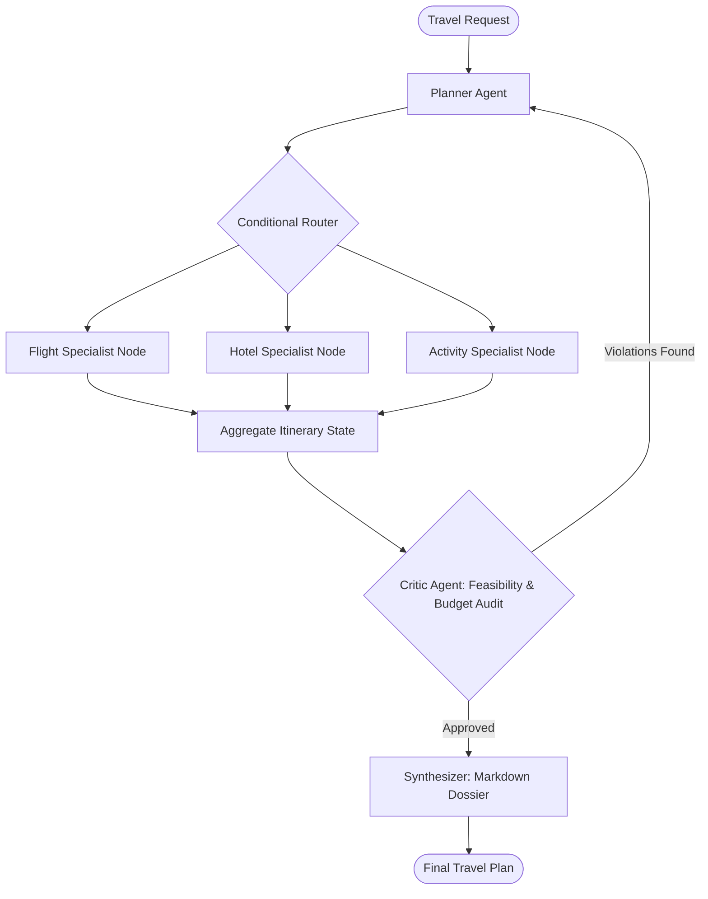

# Week 4: Multi-Agent Systems (Planner–Executor–Critic)

## 📌 Objectives & Scope
- **Role-Based Agent Design:** Decompose monolithic agent responsibilities into specialized agents: Orchestrator, Planner, Domain Specialists (Executors), Critic, and Synthesizer.
- **LangGraph State Management:** Define TypedDict state schemas, nodes, conditional edges, and reducer functions.
- **State Persistence & Checkpointers:** Implement thread isolation, checkpointing with `MemorySaver` / SQLite, and state recovery.
- **Feedback & Revision Loops:** Implement automated evaluation loops where Critic feedback triggers plan adjustment before synthesis.

---

## 🏗 Live Project: Multi-Agent Travel Planner

### Scenario
An end-to-end autonomous multi-agent travel concierge that generates customized, verified itineraries.
1. **Planner Agent:** Decomposes user travel constraints (budget, dates, preferences) into research tasks.
2. **Flight & Lodging Agents (Executors):** Search and retrieve realistic options.
3. **Activities & Weather Agent (Executors):** Map out daily activities considering weather forecasts.
4. **Critic Agent:** Audits the itinerary against budget limits, travel feasibility, and pacing.
5. **Synthesizer Agent:** Generates a unified, beautiful markdown travel guide.

### Architecture Diagram


---

## 📂 Project Structure

```text
week-04-multi-agent-systems/
├── README.md
└── travel_planner/
    ├── __init__.py
    ├── state.py            # LangGraph TypedDict state definitions
    ├── agents/
    │   ├── planner.py
    │   ├── flight_agent.py
    │   ├── hotel_agent.py
    │   ├── critic.py
    │   └── synthesizer.py
    ├── graph.py            # LangGraph stategraph compilation with checkpointer
    └── app.py              # CLI & execution entry point
```

---

## 🚀 Quickstart

```bash
# Run the Multi-Agent Travel Planner
python3 week-04-multi-agent-systems/travel_planner/app.py
```
