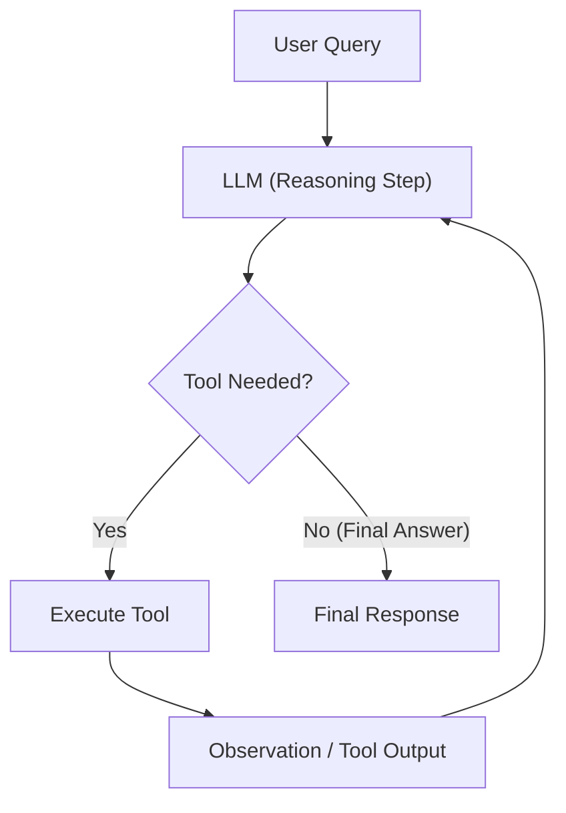

# Pattern 01: ReAct / Tool-Calling Loop

## 🎯 Purpose
Demonstrates the foundational **Reason + Act** agentic pattern where the model dynamically decides which tools to invoke, receives external observations, and iterates until the goal is achieved.

## 📐 Architecture

