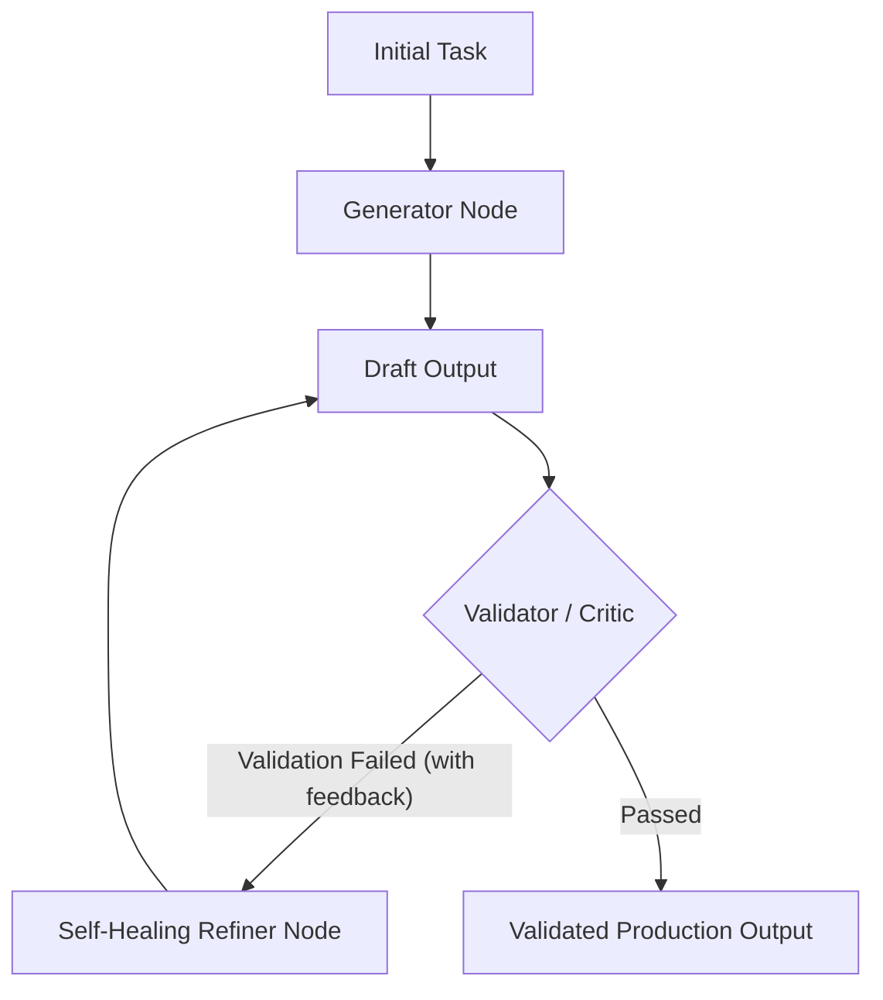

# Pattern 02: Evaluator-Optimizer & Self-Healing

## 🎯 Purpose
Demonstrates an agent architecture where a Generator creates a candidate output, an Evaluator/Validator audits it against strict rules/schemas, and errors trigger an automated Self-Correction refinement loop (as seen in `tfs_agent`).

## 📐 Architecture

