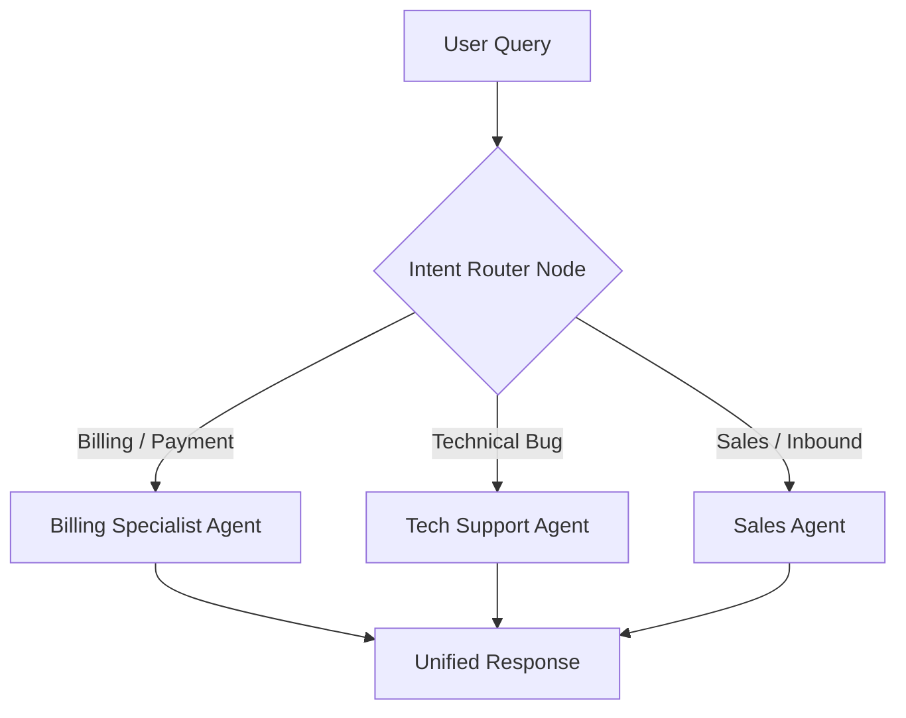

# Pattern 03: Router & Intent Classifier

## 🎯 Purpose
Demonstrates an intelligent routing pattern where incoming queries or tasks are classified to invoke specialized subgraphs, prompt pipelines, or specialized toolsets.

## 📐 Architecture

