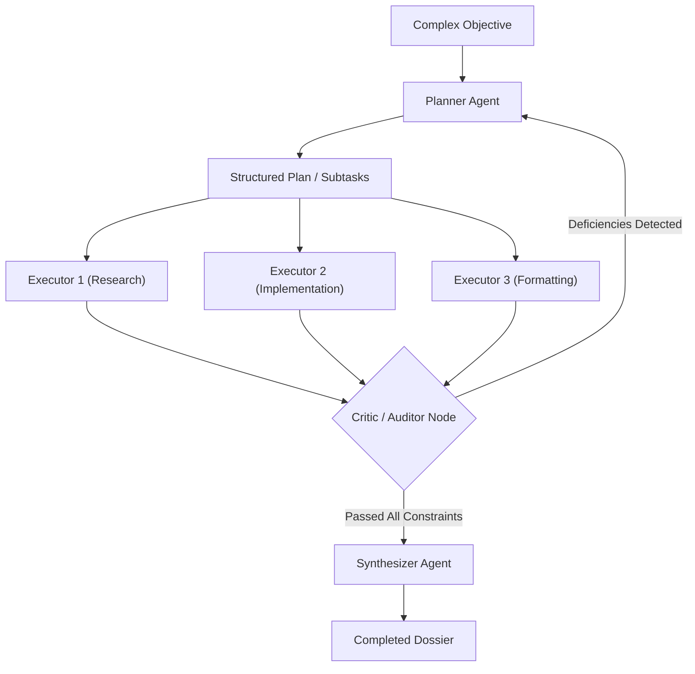

# Pattern 04: Planner-Executor-Critic

## 🎯 Purpose
Demonstrates advanced decomposition and planning. A Planner generates structured subtasks, specialized Executor nodes process subtasks concurrently, and a Critic validates the integrated output against constraints (budget, feasibility, completeness) before synthesis.

## 📐 Architecture

