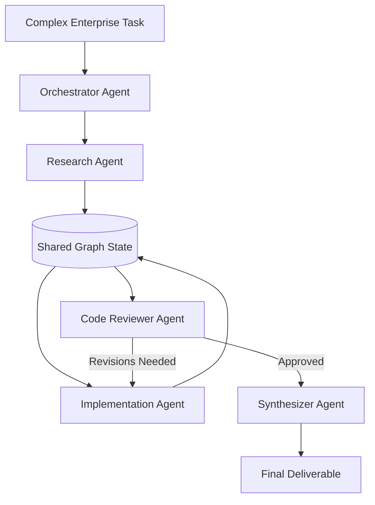

# Pattern 05: Multi-Agent Collaboration & Networked Teams

## 🎯 Purpose
Demonstrates role-based multi-agent collaboration with specialized agent nodes communicating through shared state graphs (Orchestrator, Research Specialist, Coding Specialist, Reviewer, and Synthesizer).

## 📐 Architecture

