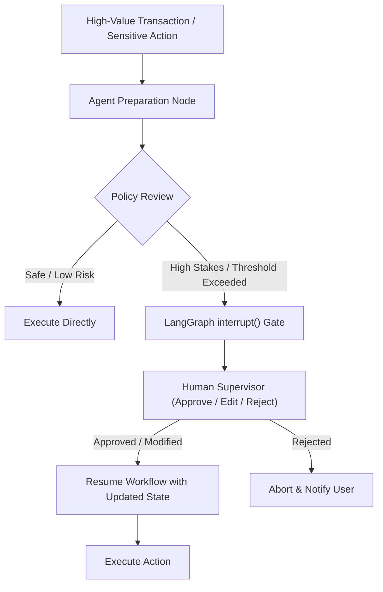

# Pattern 06: Human-in-the-Loop (HITL)

## 🎯 Purpose
Demonstrates how to safely pause agent execution before high-stakes actions using LangGraph checkpointers and `interrupt()`, collect human feedback/approval/edits, and resume state execution.

## 📐 Architecture

