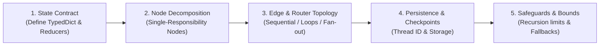
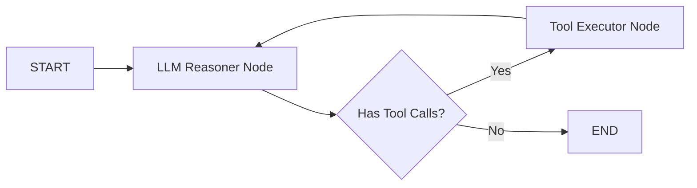
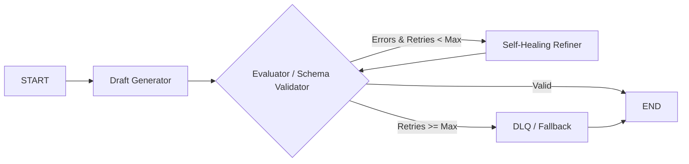
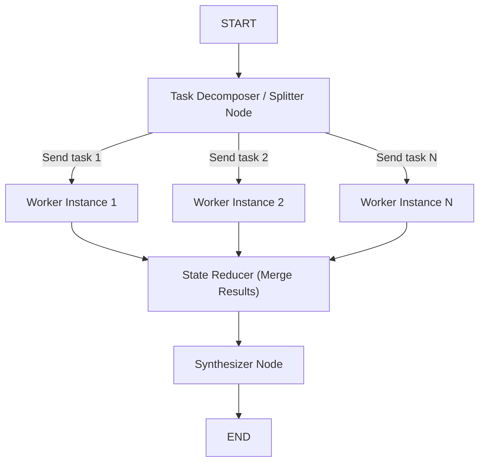
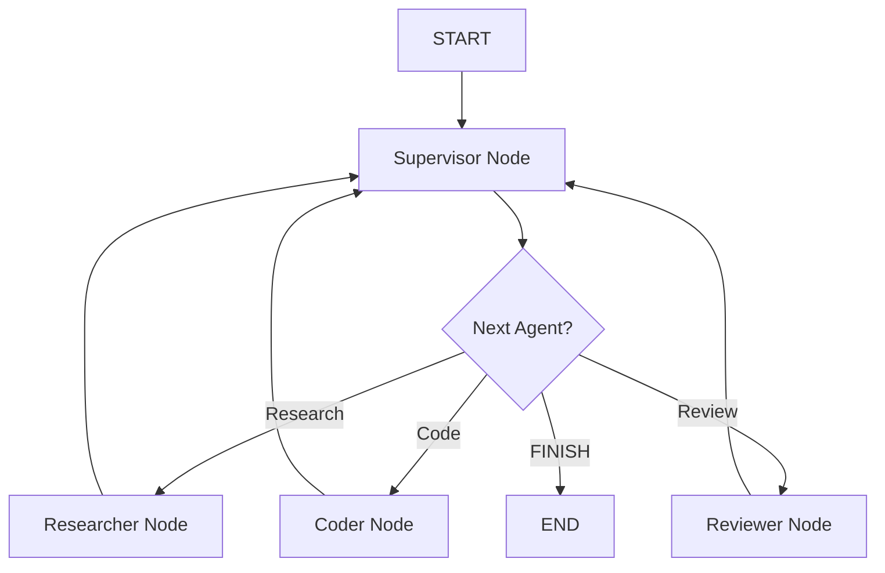

# 🧠 LangGraph StateGraph Architecture & Design Playbook

> **The Definitive Engineering Guide to Designing, Building, and Defending StateGraph Solutions for Any Problem Statement.**

---

## 📑 Table of Contents
1. [The StateGraph Mental Model](#-the-stategraph-mental-model)
2. [Anatomy of the 5 Core Building Blocks](#-anatomy-of-the-5-core-building-blocks)
3. [Prominent APIs & Core Function Reference](#-prominent-apis--core-function-reference)
4. [The 5-Step System Design Framework](#-the-5-step-system-design-framework)
5. [Architectural Blueprints Catalog](#-architectural-blueprints-catalog)
6. [Advanced Mechanics: Map-Reduce & Subgraphs](#-advanced-mechanics-map-reduce--subgraphs)
7. [Production Gotchas & Staff Engineer Best Practices](#-production-gotchas--staff-engineer-best-practices)
8. [Where We Suggest You Start (Recommended Learning Path)](#-where-we-suggest-you-start)

---

## 💡 The StateGraph Mental Model

Traditional LLM chains (like linear LCEL pipes) are **Direct Acyclic Graphs (DAGs)**: they run strictly from left to right and cannot loop, self-correct, or maintain long-running state.

**LangGraph StateGraph** models agentic workflows as a **Stateful, Cyclic Finite State Machine (FSM)**:

$$\text{Next State } S_{t+1} = \text{Node}_i\Big(S_t\Big) \quad \text{where } \text{Edge}(S_t) \longrightarrow \text{Node}_{i+1}$$

```text
               ┌───────────────────────────────┐
               │    Shared State Dictionary    │
               │  (TypedDict / MessagesState)  │
               └───────────────┬───────────────┘
                               │
               ┌───────────────┴───────────────┐
               ▼                               ▼
       ┌───────────────┐               ┌───────────────┐
       │   Node A      │               │   Node B      │
       │ (State -> Mod)│               │ (State -> Mod)│
       └───────┬───────┘               └───────┬───────┘
               │                               │
               └───────────────┬───────────────┘
                               ▼
               ┌───────────────────────────────┐
               │       Conditional Router      │
               │   (Inspects State -> Branch)  │
               └───────────────┬───────────────┘
                               │
            ┌──────────────────┴──────────────────┐
     [Loop Back to A]                      [Route to END]
            ▼                                     ▼
```

### Core Tenets of StateGraph:
1. **Isolated Nodes:** Nodes are pure, stateless Python functions that accept the current state and return **partial updates** (deltas).
2. **Immutable State Reducers:** State changes are merged via explicit reducer functions (`operator.add`, custom merge logic, or default overwrite).
3. **Deterministic Routing:** Conditional edges inspect state variables (e.g. `is_approved`, `error_count`, `intent`) to route execution dynamically.
4. **Time-Traveling & Persistence:** Every step is snapshotted to a checkpointer (`MemorySaver`, `PostgresSaver`), enabling pausing, human intervention, and replay.

---

## 🧱 Anatomy of the 5 Core Building Blocks

### 1. State Schema (`TypedDict` / `MessagesState`)
Defines the structure of data flowing through the graph.

```python
from typing import TypedDict, Annotated, List, Optional
import operator
from langchain_core.messages import BaseMessage

class AppState(TypedDict):
    # Reducer: operator.add appends new messages without overwriting history
    messages: Annotated[List[BaseMessage], operator.add]
    
    # Reducer: Default overwrite (new value replaces old value)
    current_step: str
    error_count: int
    is_valid: bool
    final_result: Optional[str]
```

### 2. Nodes (Cognitive Work Units)
A node is a callable `(state: State) -> dict`:

```python
def research_node(state: AppState) -> dict:
    # 1. Read what you need from state
    query = state["messages"][-1].content
    
    # 2. Perform work (LLM call, tool execution, DB query)
    result = execute_search(query)
    
    # 3. Return ONLY the state keys to update (partial update)
    return {
        "messages": [AIMessage(content=result)],
        "current_step": "research_completed"
    }
```

### 3. Edges (Transitions)
- **Normal Edge:** `workflow.add_edge("node_a", "node_b")` (Deterministic sequence: A $\rightarrow$ B).
- **Conditional Edge:** `workflow.add_conditional_edges("node_a", router_fn, path_map)` (Dynamic branch based on state).

```python
def route_after_validation(state: AppState) -> str:
    if state["is_valid"]:
        return "deliver"
    elif state["error_count"] < 3:
        return "retry"
    return "abort"

workflow.add_conditional_edges(
    "validator_node",
    route_after_validation,
    {
        "deliver": "delivery_node",
        "retry": "refiner_node",
        "abort": END
    }
)
```

### 4. Entry Points (`START`) and Terminal Points (`END`)
- `workflow.add_edge(START, "first_node")` or `workflow.set_entry_point("first_node")`
- `workflow.add_edge("final_node", END)`

### 5. Checkpointer (Persistence Engine)
- Compiles the graph with state snapshot persistence:
  ```python
  from langgraph.checkpoint.memory import MemorySaver
  app = workflow.compile(checkpointer=MemorySaver())
  ```

---

## 📚 Prominent APIs & Core Function Reference

| API / Method | Signature | Purpose / When to Use |
| :--- | :--- | :--- |
| `StateGraph(StateSchema)` | `workflow = StateGraph(MyState)` | Initializes a state graph parameterized by a TypedDict/Pydantic state. |
| `add_node(name, func)` | `workflow.add_node("agent", agent_fn)` | Registers a node. `func` can be sync `def` or async `async def`. |
| `add_edge(start, end)` | `workflow.add_edge("node_a", "node_b")` | Connects two nodes with a direct, unconditional transition. |
| `add_conditional_edges()`| `workflow.add_conditional_edges(source, router, path_map)` | Dynamic routing based on the return value of `router(state)`. |
| `compile(checkpointer=...)` | `app = workflow.compile(...)` | Validates graph topology and compiles into a runnable `CompiledGraph`. |
| `invoke(input, config)` | `app.invoke({"query": "..."}, config={"configurable": {"thread_id": "1"}})` | Executes graph synchronously from START until END or an interrupt. |
| `stream(input, config, stream_mode)` | `for event in app.stream(input, config, stream_mode="values"): ...` | Streams state updates, node outputs, or LLM tokens in real time. |
| `get_state(config)` | `snapshot = app.get_state(config)` | Retrieves the current state snapshot, next pending nodes, and checkpoint ID. |
| `update_state(config, values, as_node)` | `app.update_state(config, {"key": "val"}, as_node="node_name")` | Manually edits state in the checkpointer (used for Human-in-the-loop). |
| `interrupt(value)` | `user_input = interrupt({"msg": "Approve?"})` | Native LangGraph v0.2+ primitive to pause execution and await human input. |
| `Command(resume=...)` | `app.invoke(Command(resume={"approved": True}), config)` | Resumes an interrupted graph passing the supervisor's payload. |
| `Send(node, custom_state)` | `return [Send("worker", {"task": t}) for t in tasks]` | **Map-Reduce API**: Dynamically spawns $N$ parallel worker node instances. |

---

## 🎯 The 5-Step System Design Framework

When given **ANY** agentic problem statement in an interview or architecture review, apply this 5-step framework:



### Step 1: Define the State Contract
- What is the raw input?
- What intermediate artifacts are produced?
- Which fields accumulate history (`Annotated[list, operator.add]`) vs. overwrite?

### Step 2: Define Functional Nodes (Single Responsibility)
- Break the workflow into atomic cognitive steps: *Ingestion*, *Planner*, *Specialist Worker*, *Critic/Validator*, *Synthesizer*.
- Each node should perform **one logical task** and return a concise dictionary delta.

### Step 3: Map Control Flow & Routing
- Are steps sequential? $\rightarrow$ `add_edge()`
- Are steps parallel? $\rightarrow$ Fan-out edges or `Send` API.
- Is there quality verification? $\rightarrow$ Conditional loop back to refiner/planner.

### Step 4: Configure Checkpoints & HITL Gating
- Do high-risk actions occur (money, emails, deletion)? $\rightarrow$ Insert `interrupt()`.
- Bind a checkpointer (`PostgresSaver` / `MemorySaver`) with `thread_id`.

### Step 5: Add Termination & Recursion Bounds
- Enforce `max_retries` / `recursion_limit` to prevent runaway billing loops.
- Define explicit fallback / dead-letter behavior when retries exhaust.

---

## 🏛 Architectural Blueprints Catalog

### Blueprint 1: The Cyclic ReAct Tool Loop


### Blueprint 2: Evaluator-Optimizer (Self-Healing)


### Blueprint 3: Parallel Map-Reduce with `Send` API


### Blueprint 4: Hierarchical Supervisor Team


---

## 🔬 Advanced Mechanics: Map-Reduce & Subgraphs

### Dynamic Fan-Out with `Send`
When the number of subtasks is unknown at compile time, use `Send`:

```python
from langgraph.types import Send

def continue_to_workers(state: MasterState):
    # Dynamically spawns one worker node per subtask in parallel
    return [Send("worker_node", {"task": item}) for item in state["subtasks"]]

workflow.add_conditional_edges("planner_node", continue_to_workers, ["worker_node"])
```

### Subgraphs as Nodes (Compositionality)
A compiled StateGraph can be added directly as a node in a parent StateGraph:

```python
# 1. Build & compile independent child subgraph
checkout_subgraph = create_checkout_graph().compile()

# 2. Add child graph as a node in parent graph
parent_workflow = StateGraph(ParentState)
parent_workflow.add_node("checkout_flow", checkout_subgraph)
```

---

## ⚠️ Production Gotchas & Staff Engineer Best Practices

1. **Never Mutate State In-Place:**
   - ❌ *Incorrect:* `state["messages"].append(new_msg); return state`
   - ✅ *Correct:* `return {"messages": [new_msg]}` (Let LangGraph reducers handle state mutation).

2. **Always Use Typed Dict or Pydantic with Type Hints:**
   - Untyped dictionaries create subtle runtime bugs when state keys are misspelled.

3. **Always Scope Checkpoints by `thread_id`:**
   - In multi-user / multi-session environments, passing `config={"configurable": {"thread_id": user_session_id}}` guarantees thread isolation and prevents cross-user state leaks.

4. **Handle Parallel State Merge Collisions with Reducers:**
   - If two parallel nodes write to `state["results"]` without `Annotated[list, operator.add]`, one will overwrite the other. Always declare a reducer on shared keys.

---

## 🗺 Where We Suggest You Start

To build true mastery and intuition for designing StateGraphs from scratch, follow this **3-Level Practice Roadmap**:

```text
Level 1: Core Mechanics Drills (Week 4 Foundations)
├── Master State Reducers (operator.add vs custom reducers)
├── Build a 3-node conditional loop with recursion limits
└── Practice StateGraph persistence with MemorySaver & thread_id

Level 2: Advanced Dynamic Topologies
├── Implement dynamic Map-Reduce using the `Send` API
├── Build a nested Subgraph workflow (Parent Graph -> Child Graph)
└── Master the native `interrupt()` and `Command(resume=...)` HITL pattern

Level 3: Live Capstone Project Implementation
└── Build the complete "Multi-Agent Travel Planner" (Planner -> Parallel Flight/Hotel/Activity Specialists -> Critic Audit -> Synthesizer)
```

### 🚀 Immediate Next Step:
Let's build a dedicated **StateGraph Drill Lab** in this folder containing runnable code exercises covering:
1. `01_reducers_and_state_deltas.py` (Reducers & concurrency safety)
2. `02_dynamic_map_reduce_send.py` (The `Send` API for parallel task fan-out)
3. `03_subgraph_composition.py` (Nesting subgraphs inside parent graphs)
4. `04_hitl_interrupt_command.py` (Mastering `interrupt` & `Command`)

Shall we write the hands-on drill exercises for the **StateGraph Mastery Lab**?
