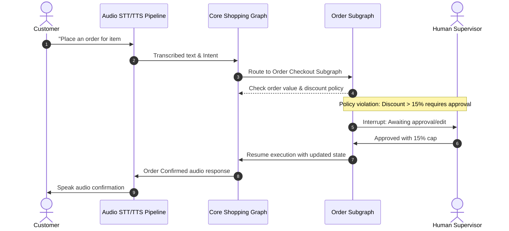

# Week 5: Conversational & Multimodal Agents with Human-in-the-Loop (HITL)

## 📌 Objectives & Scope
- **Audio & Multimodal Architectures:** Compare Cascaded (STT → LLM → TTS) architectures vs. Realtime Speech-to-Speech WebSocket streaming (latency vs. controllability).
- **Reusable LangGraph Subgraphs:** Encapsulate complex conversational flows (e.g. checkout, payment confirmation, identity verification) into modular subgraphs.
- **HITL Interaction Patterns:**
  - **Approve:** Pausing execution at critical nodes (e.g., charge credit card, modify subscription) until human confirms.
  - **Review-and-Edit:** Allowing a supervisor to edit the draft agent response/action payload before execution.
  - **Interrupt & Resume:** Handling asynchronous interruptions and injecting new state mid-workflow.

---

## 🏗 Live Project: Voice-Enabled E-Commerce Assistant with HITL

### Scenario
A high-ticket conversational e-commerce assistant assisting customers with product discovery, cart management, and order placement. When orders exceed a threshold or apply custom discounts, the agent triggers an approval interrupt requiring human confirmation or parameter edits.

### Architecture Diagram


---

## 📂 Project Structure

```text
week-05-conversational-multimodal-hitl/
├── README.md
└── ecommerce_hitl_assistant/
    ├── __init__.py
    ├── voice_pipeline.py    # Simulated STT & TTS audio layer
    ├── subgraphs/
    │   ├── discovery.py     # Product browsing subgraph
    │   └── checkout.py      # Checkout & payment subgraph
    ├── hitl_manager.py      # LangGraph interrupt and resume state handlers
    ├── state.py             # Conversation & Cart state schemas
    └── app.py               # Interactive CLI / UI runner
```

---

## 🚀 Quickstart

```bash
# Run the HITL Conversational E-Commerce Assistant
python3 week-05-conversational-multimodal-hitl/ecommerce_hitl_assistant/app.py
```
