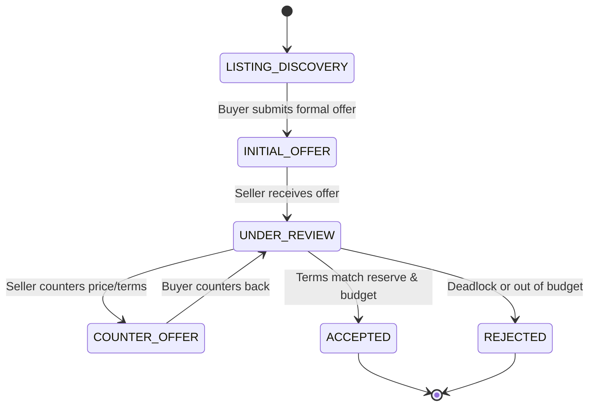

# Week 6: Agent Communication Protocols (MCP, A2A, ACP)

## 📌 Objectives & Scope
- **Model Context Protocol (MCP):** Build structured tool servers using Anthropic's open standard (`mcp` and FastMCP) for exposing tools, resources, and prompts.
- **Protocol Failure Modes:** Eliminate free-text coordination chaos (infinite loops, hallucinations, protocol drift, schema mismatches).
- **Finite State Machine (FSM) Messaging:** Enforce strict deterministic transition states (e.g. `OFFER_MADE` → `COUNTER_OFFER` → `ACCEPTED` / `REJECTED`).
- **Networked Multi-Agent Coordination:** Implement Agent-to-Agent (A2A) protocol messaging patterns with typed message validation.

---

## 🏗 Live Project: Real Estate Negotiation Simulator

### Scenario
Two autonomous agents negotiate a real estate deal under confidential constraints:
1. **Buyer Agent:** Has a hard ceiling budget, target property wishlist, and financing constraints.
2. **Seller Agent:** Has a minimum reserve price, preferred closing timeline, and inspection terms.
3. **Communication Protocol:** All interactions occur strictly through structured MCP tool calls and validated FSM transitions, ensuring valid turns, schema adherence, and auditability.

### Architecture Diagram


---

## 📂 Project Structure

```text
week-06-agent-communication-protocols/
├── README.md
└── real_estate_negotiation/
    ├── __init__.py
    ├── mcp_servers/
    │   ├── property_mcp.py    # FastMCP server for property listings & MLS data
    │   └── escrow_mcp.py      # FastMCP server for escrow contracts
    ├── protocol_fsm.py        # Strict FSM and Pydantic message envelopes
    ├── buyer_agent.py         # Autonomous Buyer Agent
    ├── seller_agent.py        # Autonomous Seller Agent
    └── simulator.py           # Simulation engine and telemetry logger
```

---

## 🚀 Quickstart

```bash
# Run the Real Estate Protocol Negotiation Simulator
python3 week-06-agent-communication-protocols/real_estate_negotiation/simulator.py
```
