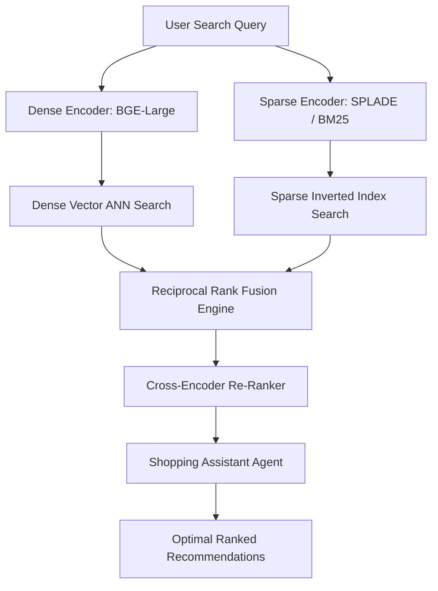

# Week 7: Hybrid Search & Retrieval (SPLADE + Dense + RRF)

## 📌 Objectives & Scope
- **Vector Search Fundamentals:** Mathematical comparison of sparse vs. dense representations, inner product, cosine similarity, k-NN vs. Approximate Nearest Neighbors (ANN), and HNSW graph indexing.
- **Learned Sparse Embeddings (SPLADE):** Why term expansion with neural sparse models out-performs vanilla BM25 for technical and domain-specific vocabularies.
- **Reciprocal Rank Fusion (RRF):** Combining disparate ranking distributions without raw score calibration dependencies.
- **Qdrant Hybrid Retrieval:** Executing multi-vector sparse + dense queries with score fusion and cross-encoder re-ranking.

---

## 🏗 Live Project: Hybrid Product Search Agent (SPLADE + BGE + RRF)

### Scenario
An e-commerce product catalog search agent where pure dense semantic search fails on exact part numbers/SKUs (e.g. `RTX-4090-OC-24GB`) and pure keyword search fails on semantic queries (e.g. `quiet graphics card for high-end 4k gaming`).
The hybrid agent combines:
1. **Dense Vectors:** `BAAI/bge-large-en-v1.5` for deep conceptual & semantic retrieval.
2. **Learned Sparse Vectors:** `SPLADE` / `BM25` for exact acronyms, brand names, and SKU matching.
3. **Fusion:** Reciprocal Rank Fusion ($RRF = \sum \frac{1}{k + r_i}$) to deliver superior Mean Average Precision (MAP) and Recall@K.

### Architecture Diagram


---

## 📂 Project Structure

```text
week-07-hybrid-search-retrieval/
├── README.md
└── hybrid_product_search/
    ├── __init__.py
    ├── dense_indexer.py      # BGE dense vector pipeline
    ├── sparse_indexer.py     # SPLADE / BM25 sparse indexer
    ├── rrf_fusion.py         # Reciprocal Rank Fusion implementation
    ├── qdrant_hybrid.py      # Qdrant client hybrid collection setup
    ├── evaluation.py         # Recall@K and MRR benchmark comparison
    └── agent.py              # Product search assistant agent
```

---

## 🚀 Quickstart

```bash
# Run the Hybrid Search benchmark and agent demonstration
python3 week-07-hybrid-search-retrieval/hybrid_product_search/agent.py
```
