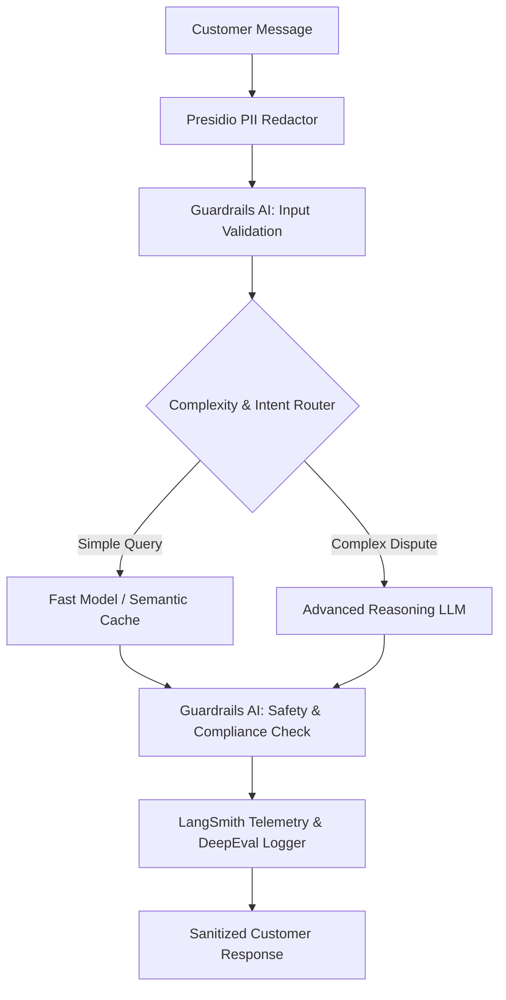

# Week 8: Agent Observability, Evaluation & Safety

## 📌 Objectives & Scope
- **Telemetry & Tracing with LangSmith:** Distributed trace collection, parent-child run hierarchy, token and latency attribution per tool/node.
- **Automated Evaluations & LLM-as-a-Judge:** Continuous evaluation pipelines using DeepEval (Faithfulness, Answer Relevance, Hallucination, and G-Eval custom criteria).
- **Enterprise Safety & Guardrails:**
  - Input/Output validation with Guardrails AI.
  - PII Detection and Anonymization with Microsoft Presidio (SSNs, credit cards, emails, phone numbers).
- **Cost & Latency Engineering:** Smart semantic caching, prompt routing (cheap model vs. reasoning model), and batching.

---

## 🏗 Live Project: Production-Ready Fintech Support Agent

### Scenario
A customer support agent for a regulated digital banking and investment application.
1. **PII Redaction:** Intercepts incoming messages and automatically sanitizes bank account numbers, SSNs, and credit cards before calling any external LLM.
2. **Deterministic Guardrails:** Rejects investment advice or out-of-bounds regulatory statements.
3. **Model Routing:** Routes routine balance/transaction lookups to fast, inexpensive models while routing fraud disputes to high-reasoning models.
4. **DeepEval Test Suite:** Automated CI/CD test suite proving zero regression in safety and quality.

### Architecture Diagram


---

## 📂 Project Structure

```text
week-08-observability-evals-safety/
├── README.md
└── fintech_support_agent/
    ├── __init__.py
    ├── guardrails/
    │   ├── pii_sanitizer.py    # Microsoft Presidio anonymizer
    │   └── safety_rules.py     # Guardrails AI compliance validators
    ├── evals/
    │   ├── test_deepeval.py    # DeepEval test suite (G-Eval, Faithfulness)
    │   └── dataset.json        # Curated benchmark evaluation dataset
    ├── router.py               # Cost-aware model router & semantic cache
    └── agent.py                # Production fintech agent pipeline
```

---

## 🚀 Quickstart

```bash
# Run the Fintech Agent with Safety Guardrails & PII redaction
python3 week-08-observability-evals-safety/fintech_support_agent/agent.py

# Run automated DeepEval test suite
pytest week-08-observability-evals-safety/fintech_support_agent/evals/ -v
```
