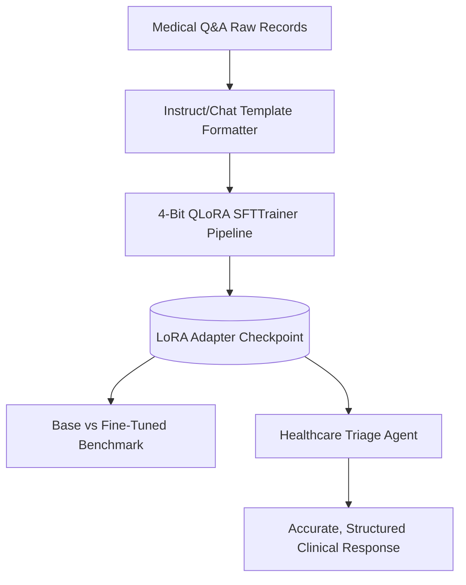

# Week 9: Fine-Tuning & Domain Adaptation

## 📌 Objectives & Scope
- **The Decision Framework:** When to use Prompt Engineering vs. RAG vs. Parameter-Efficient Fine-Tuning (PEFT).
- **PEFT Landscape:** Parameter-efficient adaptations: LoRA (Low-Rank Adaptation), QLoRA (4-bit Quantized LoRA), Prefix Tuning, and Bottleneck Adapters.
- **Quantization & Training Pipeline:** 4-bit `bitsandbytes` quantization (NF4 format), Hugging Face `TRL` (`SFTTrainer`), dataset tokenization, and loss curve monitoring.
- **Adapter Packaging & Deployment:** Merging LoRA weights, saving adapter artifacts, and publishing to Hugging Face Hub.

---

## 🏗 Live Project: Fine-Tuned Healthcare Q&A Agent

### Scenario
General foundation models often struggle with medical terminology formatting, clinical summary schemas, and triage consistency without extensive prompt tokens.
This project:
1. Prepares a domain dataset (clinical Q&A / medical reasoning based on MedQuAD/PubMedQA formats).
2. Fine-tunes an open-source base LLM (e.g., Llama-3-8B / Mistral-7B) using 4-bit QLoRA and `SFTTrainer`.
3. Evaluates the domain adapter against the zero-shot base model on medical formatting, terminology adherence, and token efficiency.
4. Integrates the fine-tuned adapter into an agentic clinical workflow.

### Architecture Diagram


---

## 📂 Project Structure

```text
week-09-fine-tuning-domain-adaptation/
├── README.md
└── healthcare_qa_agent/
    ├── __init__.py
    ├── dataset_prep.py       # Dataset cleaning, formatting & chat templates
    ├── train_lora.py         # QLoRA training script with TRL SFTTrainer
    ├── benchmark.py          # Comparative evaluation (Base vs Fine-tuned)
    ├── export_hf.py          # Weight merging and Hugging Face Hub exporter
    └── agent.py              # Clinical assistant agent using fine-tuned model
```

---

## 🚀 Quickstart

```bash
# Prepare dataset & run local benchmark simulation
python3 week-09-fine-tuning-domain-adaptation/healthcare_qa_agent/benchmark.py
```
