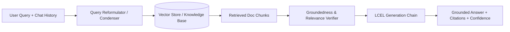

# Weeks 2–3: RAG-Powered Knowledge Agents

## 📌 Objectives & Scope
- **Retrieve → Augment → Generate:** Build clean, modular RAG pipelines with LangChain Expression Language (LCEL).
- **Multi-Turn Conversational RAG:** Manage contextual history, contextual query reformulation (Condense Question), and session windows.
- **Hallucination Prevention:** Strict citation anchoring, self-correction, and source-grounded answering.
- **Quantitative Metrics:** Compute Precision@K, Mean Reciprocal Rank (MRR), Context Relevance, and Groundedness scores.

---

## 🏗 Live Project: Grounded IT Support Knowledge Assistant

### Scenario
An internal enterprise IT Helpdesk assistant answering technical queries (VPN, SSO, Hardware provisioning, Email setup) strictly from verified enterprise documentation, providing direct citations and confidence scores.

### Architecture Diagram


---

## 📂 Project Structure

```text
weeks-02-03-rag-knowledge-agents/
├── README.md
└── it_support_assistant/
    ├── __init__.py
    ├── pipeline.py         # LCEL RAG pipeline
    ├── retriever.py        # Chunking, indexing, and multi-stage retriever
    ├── evaluation.py       # Precision@K, Groundedness, and Hallucination metrics
    ├── knowledge_base/     # IT docs (VPN, SSO, Hardware policies)
    └── app.py              # Interactive runner
```

---

## 🚀 Quickstart

```bash
# Run the Grounded IT Assistant and evaluation benchmark
python3 weeks-02-03-rag-knowledge-agents/it_support_assistant/app.py
```
