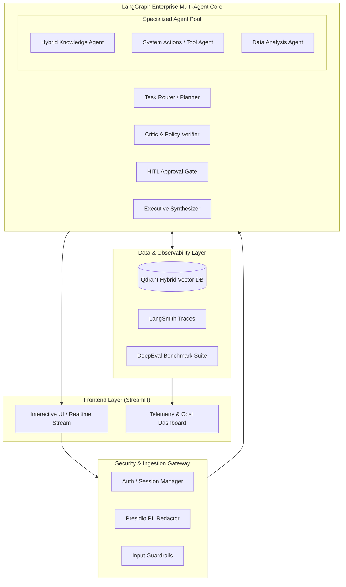

# Weeks 10–11: Capstone — Enterprise Multi-Agent System

## 📌 Objectives & Scope
- **Production Enterprise Architecture:** Integrate retrieval (Hybrid RRF), multi-agent coordination (LangGraph Planner-Executor-Critic), structured protocol communications, observability (LangSmith), safety guardrails (Presidio/Guardrails AI), and cost monitoring into a unified platform.
- **Defensible Production Engineering:** Defend SLA targets, P95 latency, token cost breakdowns, failure recovery mechanisms, and evaluation benchmarks as done in enterprise architecture reviews.
- **Full-Stack Deployment:** Scalable LangGraph backend with asynchronous workers, interactive Streamlit analytics & conversation UI, and Docker Compose deployment blueprints.

---

## 🏗 Live Project: Enterprise Multi-Agent Platform

### High-Level Architecture


---

## 📂 Project Structure

```text
weeks-10-11-capstone-enterprise-system/
├── README.md
├── docker-compose.yml        # Multi-container deployment (App, Qdrant, Redis)
└── enterprise_agent_system/
    ├── __init__.py
    ├── backend/
    │   ├── graph.py          # Master enterprise LangGraph workflow
    │   ├── state.py          # Unified state schema
    │   ├── agents/           # Specialized worker agent nodes
    │   └── tools/            # Enterprise connectors & MCP tools
    ├── frontend/
    │   └── app.py            # Streamlit multi-page enterprise dashboard
    ├── evals/
    │   ├── test_suite.py     # End-to-end regression benchmarks
    │   └── cost_analyzer.py  # Token budgeting & latency auditor
    └── config.py             # Enterprise configuration & secrets
```

---

## 🚀 Quickstart

```bash
# Launch interactive Streamlit interface
streamlit run weeks-10-11-capstone-enterprise-system/enterprise_agent_system/frontend/app.py
```
